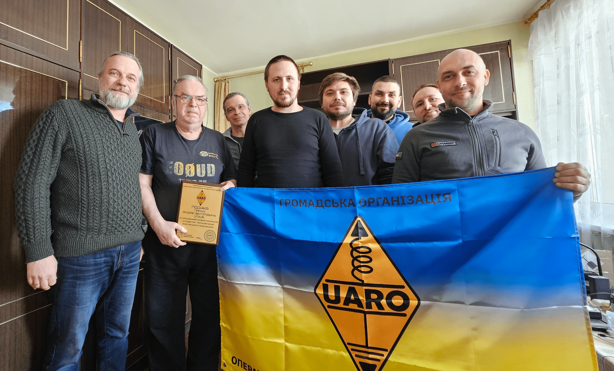
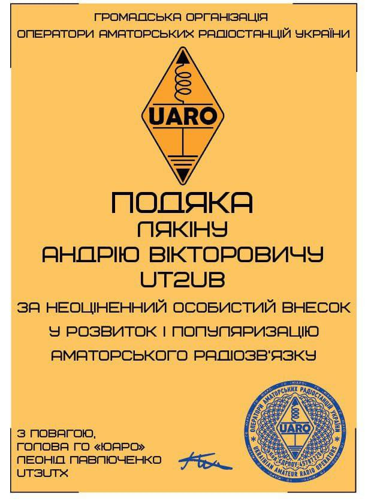

Засновники та учасники ГО «UARO» зібралися в атмосфері невимушеної теплоти для зустрічі зі справжнім майстром радіоаматорства 
– Андрієм Вікторовичем Лякіним (UT2UB), головою Київської КТК.

<!-- truncate -->

:::info[Позивні учасників]
UR4CTA, UT2UB, UT8UP, UT3UTX, UT3UUE, UR7HNF, UR4USB, UT3UUK
:::

Під час зустрічі він щиро поділився історіями зі своєї багаторічної кар'єри, які надихнули присутніх. Обговорення торкнулося перспектив подальшого розвитку організації, ефективних методів залучення молоді до аматорського радіозв’язку та амбітних планів створення колективної радіостанції на базі ГО.

Від імені голови та всього колективу Андрію Вікторовичу було урочисто вручено почесну подяку за його невтомну відданість справі, що надихає нові покоління радіоаматорів.

