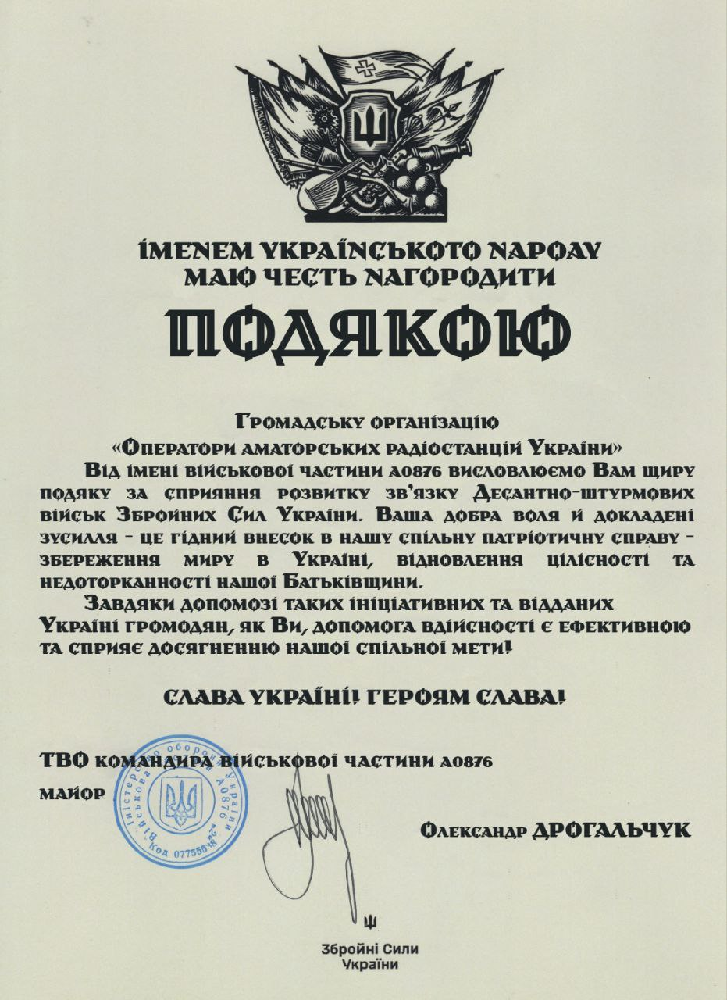

3.2.15 Статуту ГО "Оператори аматорських радіостанцій України":
«Сприяння Силам Оборони України в питаннях організації радіозв’язку, матеріальна та технічна підтримка Збройних Сил України в галузі зв’язку».

<!-- truncate -->

Це не просто рядок у документі.
Це про нашу щоденну роботу.
Про кожного, хто допомагає UARO — руками, знаннями, донатами.

Дякуємо, що ви з нами.
Разом — на зв’язку.
Разом — до перемоги.

