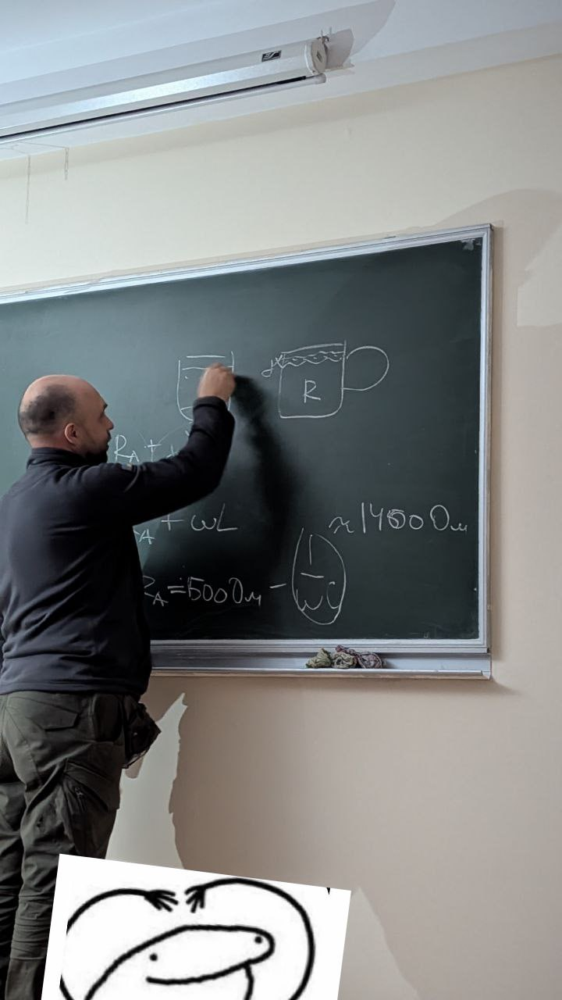
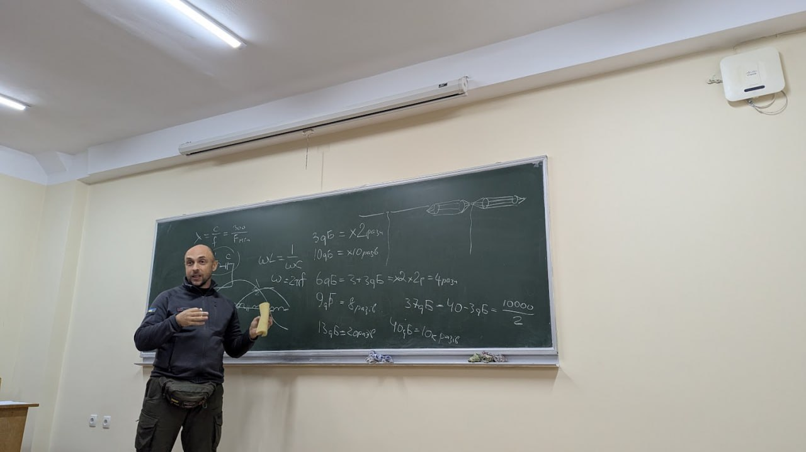
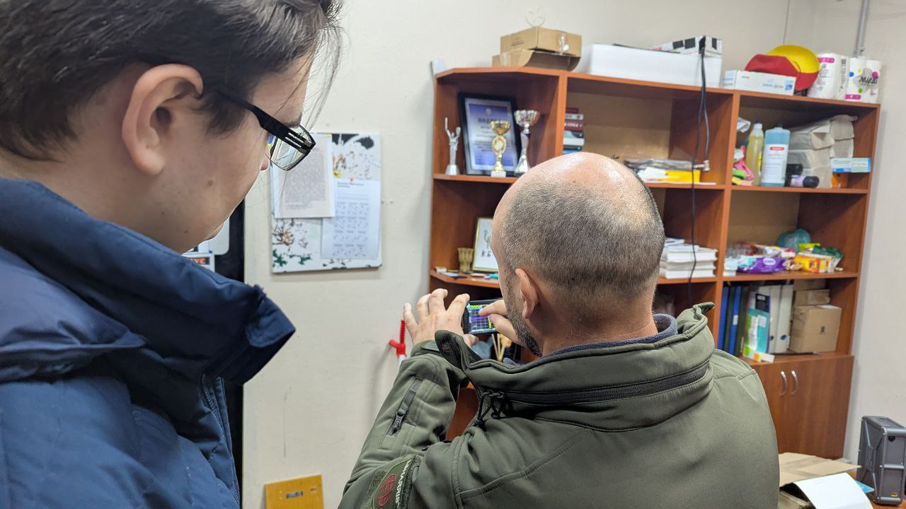
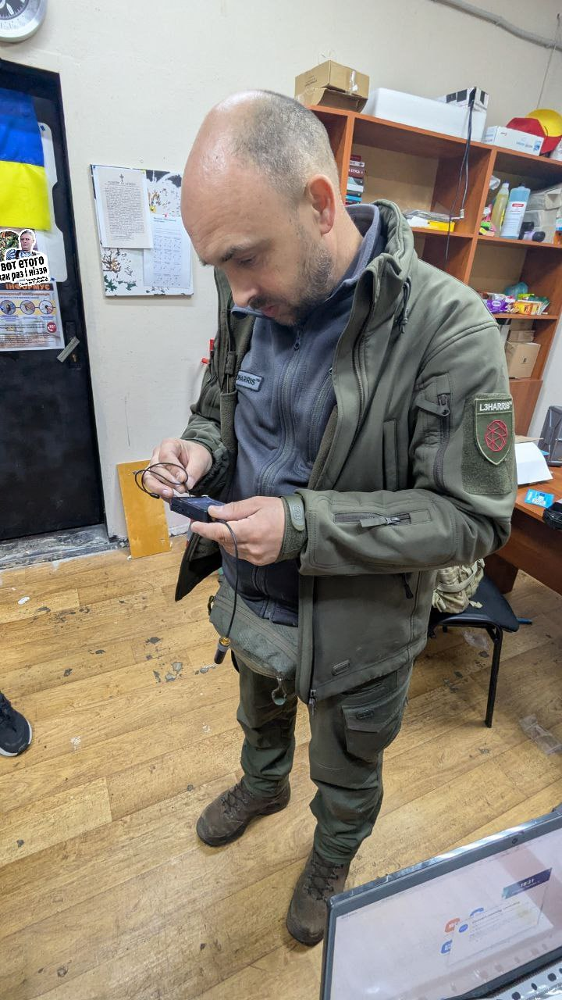

Інженерний гурток 📡 UARO: Від теорії до ефіру

<!-- truncate -->

🔸 Вчора відбулось перше заняття гуртку! Попри відключення світла ми здобуваємо спеціальність і цікаве хобі 🔥

🔸 Тема: Проектування АФП (антенно-фідерних пристроїв), теорія телекомунікацій.

💬 Заняття проводив Віталій Лазебник (UT0UI), випускник НН ІТС, Інструктор ТОВ "Радіо Сатком Груп"

📌 Бажаєте знати більше про роботу гуртка та долучитись? Слідкуйте за офіційними сторінками НН ІТС та [керівника](https://t.me/kost_litopys) гуртка за тегом #uaro 😉

