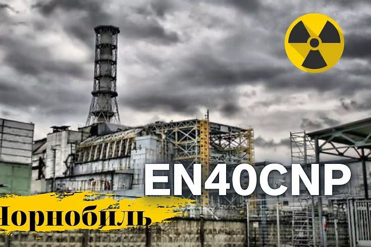

Підсумки роботи EN40CNP
По-перше, хочу подякувати нашій команді: Сергію UX2CT, Євгену UR0UE та Петру UR3PKI, які приклали максимум зусиль для того, щоб організувати роботу позивного та працювати в ефірі та Леоніду UT3UTX і Костянтину UT2UCN за моральну підтримку. За два тижні активності з 18 по 30 квітня нами було проведено 1565 QSO з 111 країнами світу в SSB, CW та FT8. На вихідних навіть збиралися годинні пайлапи в SSB на 20м.

<!-- truncate -->

В цілому, ідея виникла не спонтанно, а була запланована ще перед новим роком. Відповідно, заявку на отримання цього СПС ми подали заздалегідь.
Початковою ціллю була міні експедиція в Чоронобильську зону відчудження на пам'ятні дати, але у зв'язку з бойовою обстановкою, ми так і не змогли отримати дозвіл на експедицію, тому перейшли до плану Б - роботу з домашніх QTH.
Тут теж все пішло не так гладко, як хотілося б - Андрію UT3UUE, який планував активно працювати в УКХ уламком шахеда перебило кабель до антени і він випав з обойми, то ж довелося іншим членам команди підхоплювати і ці діапазони.
Петро написав для нас дуже зручний чатбот, в якому ми відмічалися, коли виходили в ефір та, відповідно, наша активність відображалася й на сторінці [qrz.com](https://www.qrz.com/db/EN40CNP)
Хочемо подякувати всім, хто підходив на загальний виклик і до зустрічі в ефірі!

