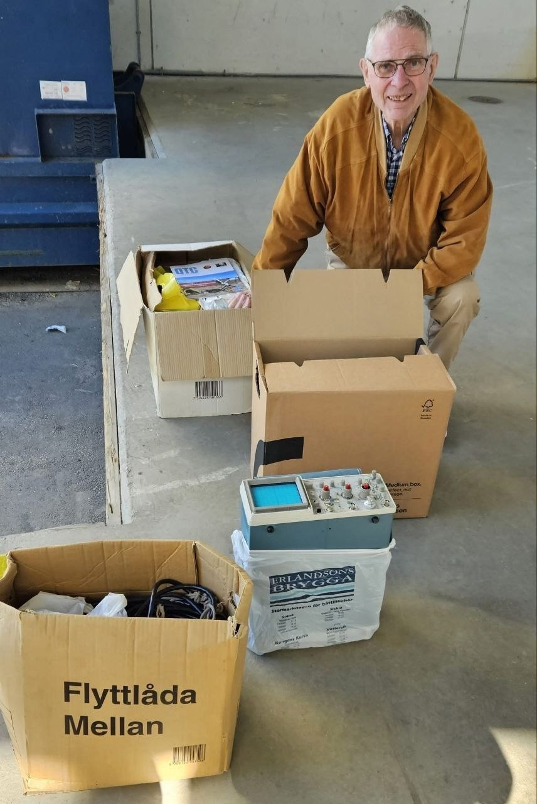

🇺🇦🇸🇪Співпраця UARO і спільноти радіоаматорів Швеції

<!-- truncate -->

SM0AVX Томмі з Ярфелли першим відгукнувся на наше звернення про пожертви Україні та прибув на Operation-Change у Соллентуні з радіообладнанням. Томмі привіз із собою, серед іншого, КХ-трансивер Heathkit SB-101, осцилограф Tektronix, ротор та деякі інші речі. На фото він щойно розвантажив їх на вантажній рампі. Томмі також є одним із найактивніших учасників CW-групи SK7RN.

Дякую за ваші зусилля, Томмі. Сподіваюся, багато інших наслідуватимуть ваш приклад і передадуть своє невикористане обладнання друзям-радіо в Україні.

Все майно буде передано на радіо гурток UARO  у КПІ.

