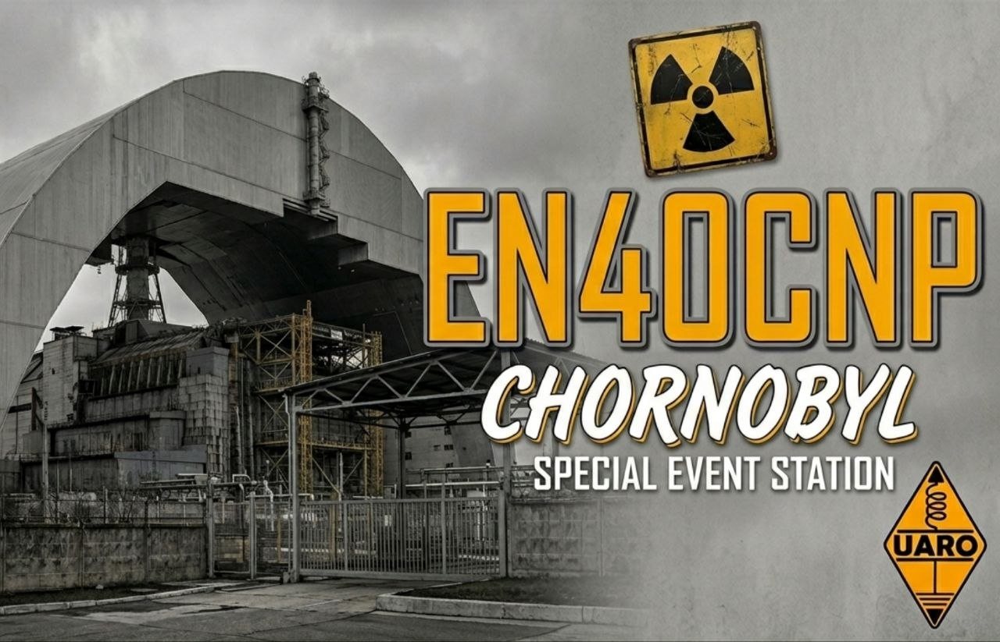

Нещодавно завершилася наша активність спецпозивним EN40CNP! 

<!-- truncate -->

Робота в ефірі була присвячена 40-м роковинам трагедії на Чорнобильській АЕС та організована ГО "UARO" в рамках дипломної програми Chornobyl-40.
За два тижні (з 18 по 30 квітня) ми провели 1565 QSO зі 111 країнами світу в SSB, CW та FT8. На вихідних на 20м навіть збиралися годинні пайлапи! 🌍
Спершу планували мініекспедицію в Зону відчуження, але через бойові дії дозвіл отримати не вдалося, тому працювали за планом Б — з домашніх QTH.
Окремий респект Петру (UR3PKI) за зручний чатбот для миттєвого відображення нашої активності на сторінці [qrz.com](https://qrz.com).

Склад нашої команди:
🔹 Сергій UX2CT
🔹 Євген UR0UE
🔹 Віталій UT0UI
🔹 Костянтин UT2UCN
🔹 Петро UR3PKI

Усі логи завантажені в LoTW та на QRZ. 
За паперовими QSL-картками звертайтеся до [@UARO73](https://t.me/UARO73) 📝

Дякуємо всім, хто підходив на загальний виклик.
До зустрічі в ефірі! 73! 📡🇺🇦

[https://www.qrz.com/db/EN40CNP](https://www.qrz.com/db/EN40CNP)

