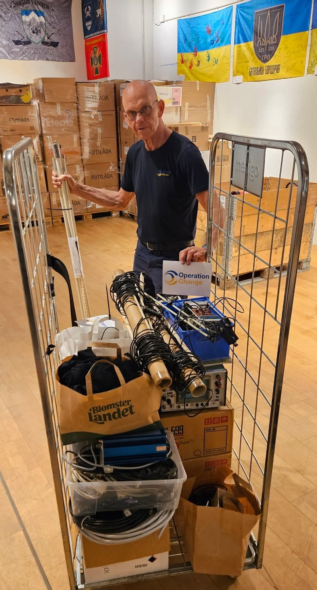
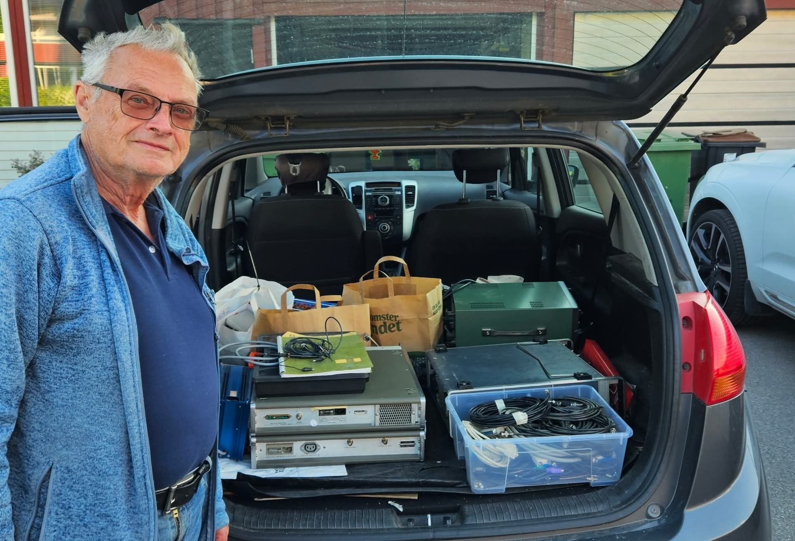
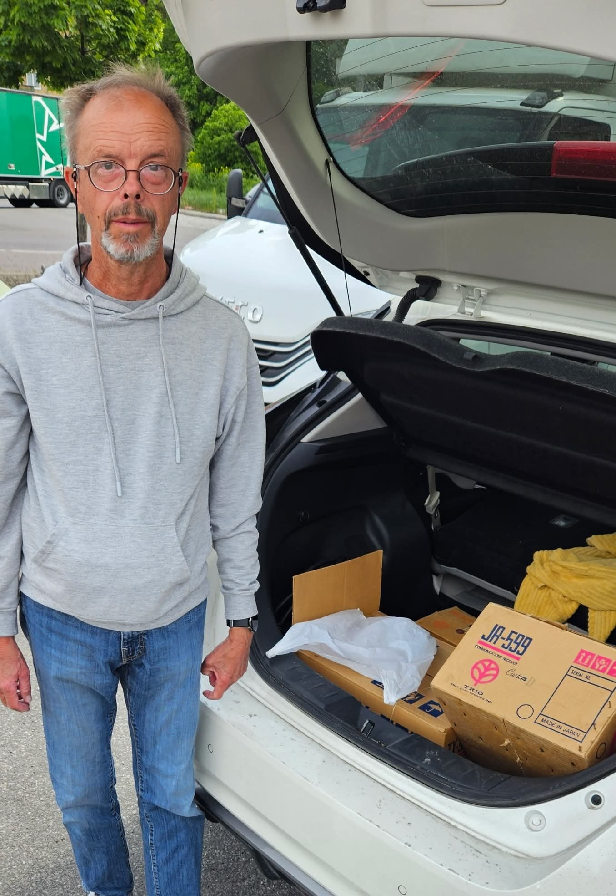

Радієш і захоплюєшся...
...тією щедрістю радіоаматорів з усієї країни, які передають обладнання нашим друзям в Україні. А ще й долають великі відстані, щоб доставити його організації Operation-Change. На фото керівник Op-change Йоран Скоглунд приймає цьоготижневий «урожай» у Соллентуні від, зокрема, SM5FXK/Ульфа та SMØEOQ/Бо. Велика подяка вам та всім іншим благодійникам, не в останню чергу тим, хто передав вантаж на термінал у Нюбру через SM7OHE/Рольфа у Фер'єстадені.
До речі, чув, що перший піддон із радіоапаратурою вже знаходиться на кордоні з Україною.
Але радіоклуби в Україні мають велику потребу, тому подивіться, чим ви також можете допомогти.
73 de SMØDMY

<!-- truncate -->

[https://www.facebook.com/share/p/18wqvbigtN/](https://www.facebook.com/share/p/18wqvbigtN/)

Ми щиро вдячні нашим шведським друзям за підтримку!

