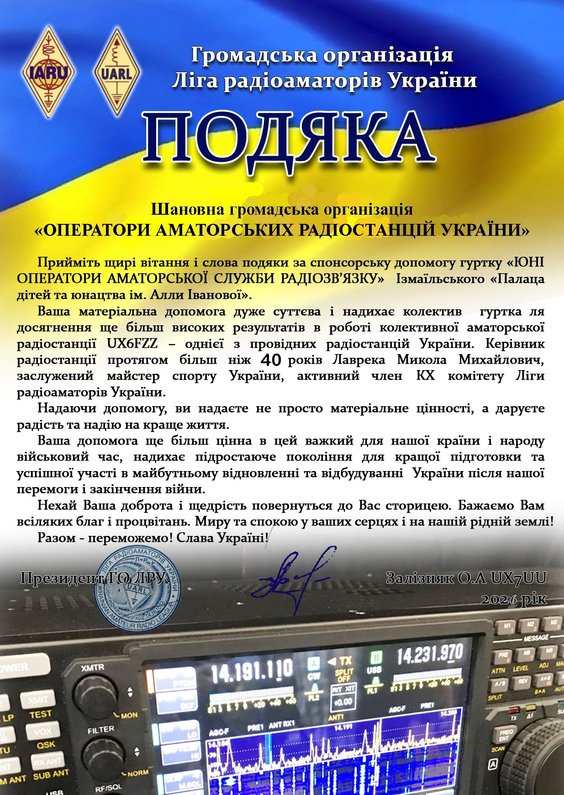

Обладнання від шведського колективу SK7RN уже знаходить своїх нових власників 🫡

<!-- truncate -->

Раніше ми казали про допомогу від шведського колективу SK7RN у вигляді ящиків з обладнанням. Так ось, все це обладнання вже знаходить своїх нових власників - дитячі та юнацькі колективні радіостанції, клуби та ДЮСШ. Колектив UX6FZZ обрано не випадково, це найактивніша дитяча колективка завдяки її невтомному керівникові Миколі Лавреці UX0FF. Колективці було передано КХ трансивер, декілька портативок та інші приємні бонуси. І це тільки початок :) 
P.S. Якщо ви керівник колективки або гуртка - звертайтеся до адмінів з заявками, будемо раді допомогти!

