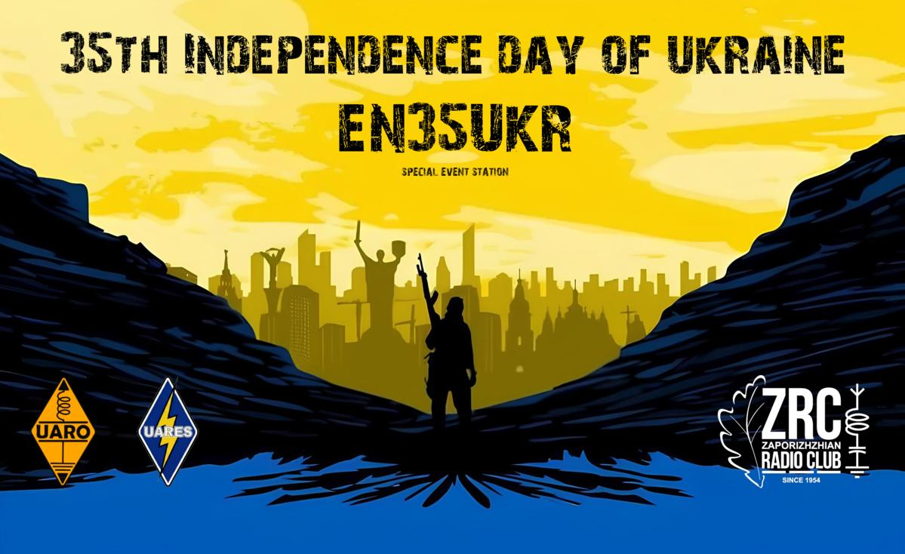

Шановне товариство! З нагоди 35-ї річниці незалежності України ГО "Оператори Аматорських Радіостанцій України", ГО "Всеукраїнська Радіоаматорська Аварійна Спілка" та ГО "Запорізький радіоклуб" засновано святковий диплом та робота спеціального позивного EN35UKR. СПС звучатиме в ефірі з 1.08 по 31.08 в діапазонах 80, 40, 30, 20, 17, 15, 12, 10, 2м та 70см у всіх дозволених модуляціях; робота здійснюватиметься колективом радіоаматорів з усіх куточків України. Умови диплому прості: 35 проведених QSO з СПС на різних бендах різними модами. Повтори в різні дні допускаються. Слідкувати за активністю позивного в ефірі можна на сторінці[qrz.com](https://www.qrz.com/db/EN35UKR) або [uahamaward.com](https://uahamaward.com/awards/019f95c0-1e60-7209-9248-c12a3911bbc1). Бажаючі можуть звернутися до організаторів для обміну QSL картками за проведений зв'язок. До зустрічі в ефірі. Слава Україні!

