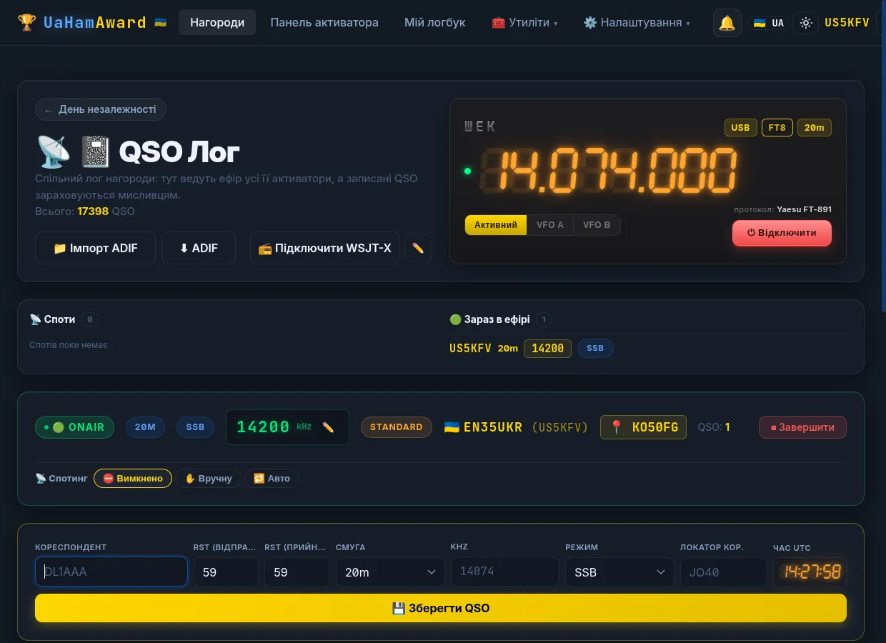
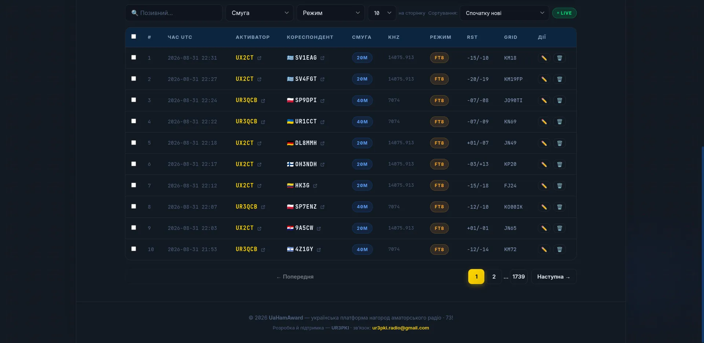
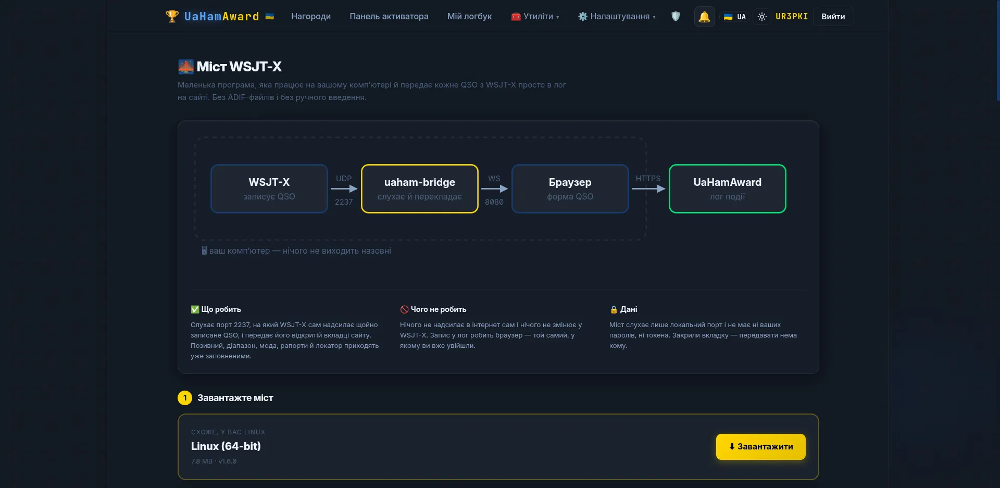
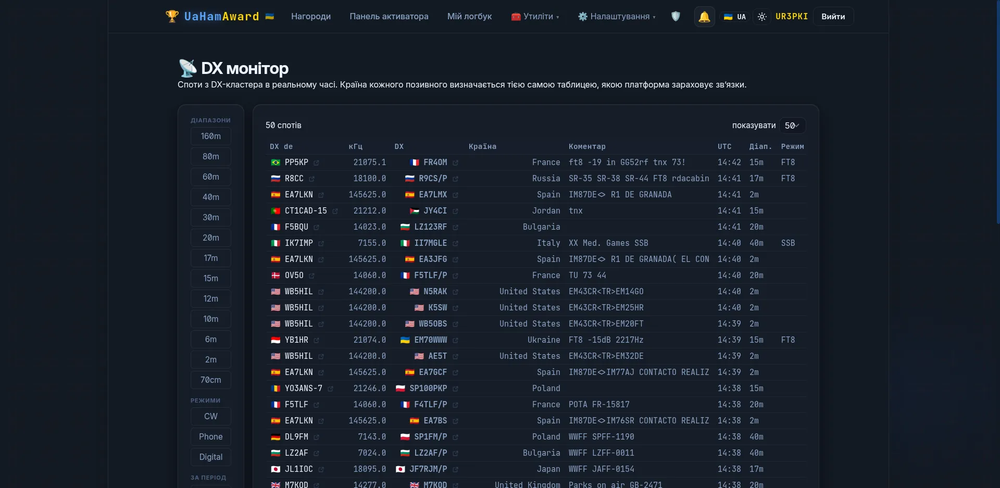
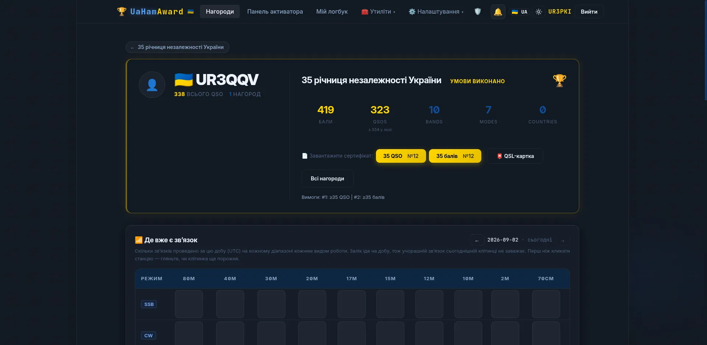
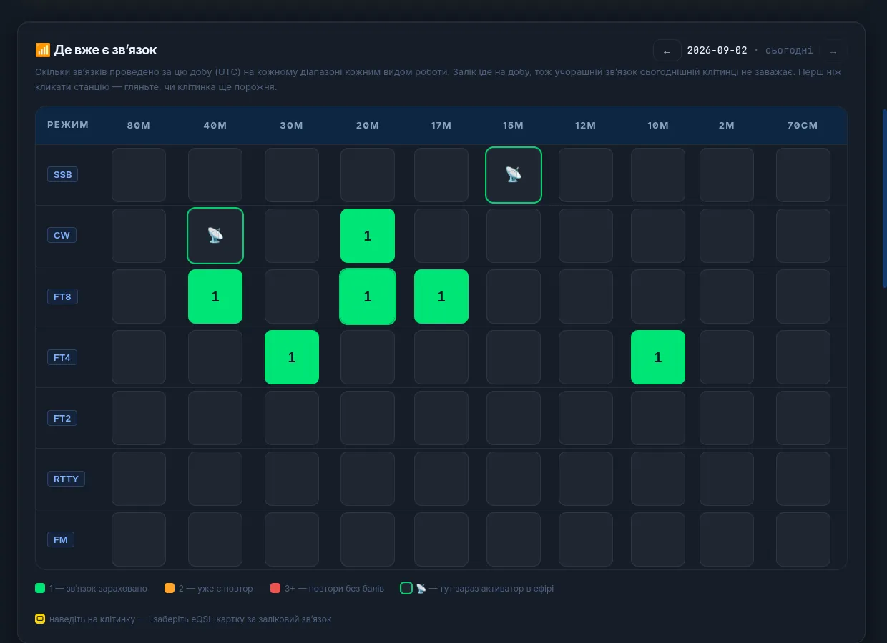
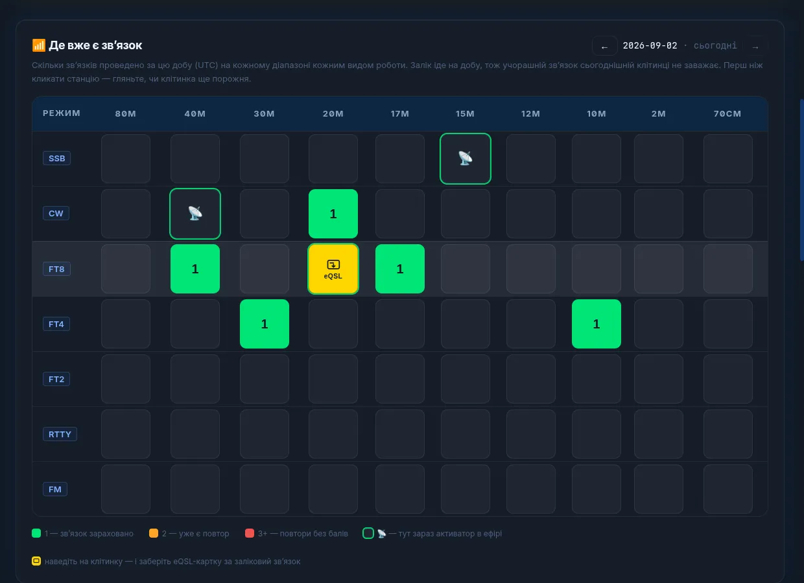
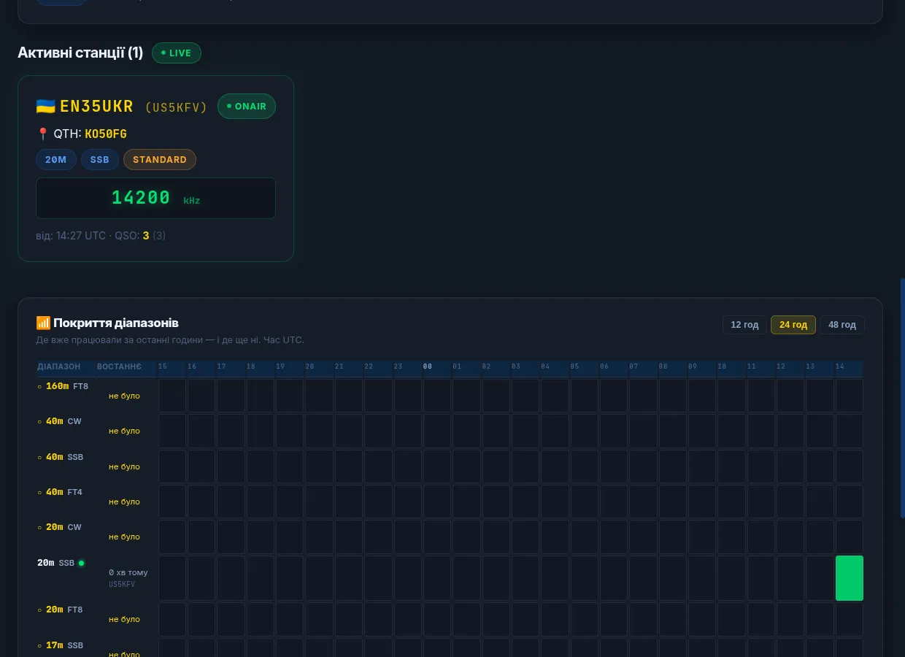
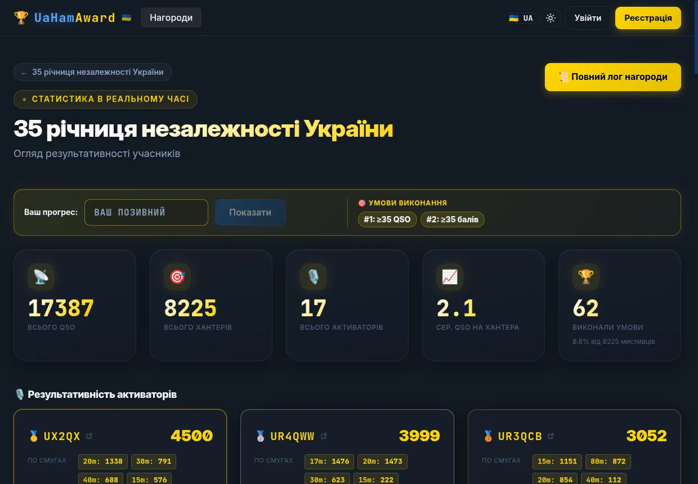
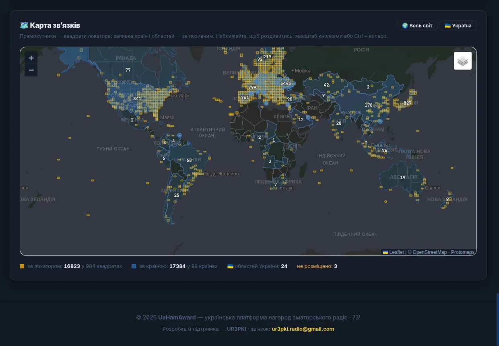

Ідея цієї платформи — моя, архітектуру я закладав ще у 2025-му і писав її сам.

**6 березня 2026-го** я вперше показав її живою — з власного ноутбука, через ngrok, посилання
жило до півночі. Уже тоді вона вела спільний лог, приймала зв'язки від WSJT-X по UDP,
імпортувала ADIF із перевіркою дублів і мала окремі кабінети для хантера й для організатора.
Наступного вечора з'явився міст для цифрових мод — під Windows, Linux і macOS.

У квітні, через сім тижнів після того показу, паралельно йшла активність спецпозивним EN40CNP до
40-х роковин Чорнобиля. Два тижні, 1565 зв'язків, кілька операторів — і весь лог зводили руками:
платформа на той момент ще не була готова до бойового застосування. Той досвід найточніше
сформулював Віталій UT0UI: **«зливати логи постфактум руками — це те ще дрочилово»**.

До серпня вона була готова. Нижче — що з цього вийшло: платформа
[uahamaward.com](https://uahamaward.com), на якій нагорода «35 річниця незалежності України»
провела **17 387 зв'язків за 31 день**, і жоден із них ніхто не зводив руками — ні під час місяця,
ні після нього.

<!-- truncate -->

## Спершу про проблему

Кожен веде свій лог. Потім усе зводиться в один файл. Потім виявляється, що двоє працювали
одночасно на одній смузі й моді. Потім хтось загубив адіфку. Потім LoTW відмовляється приймати
дублікати.

На 1565 зв'язках це кілька вечорів. На сімнадцяти тисячах це вже не робота, а неможливість.

## Чотири вимоги

До серпневої активності я поставив собі не задачу «зробити сайт», а чотири конкретні болі, які
треба закрити.

1. **Двоє не мають ставати на одну смугу й моду одночасно.** Хтось має бачити, хто де зараз в
   ефірі — і бачити зараз, а не потім.
2. **Лог має бути спільним і живим.** Не файл у кінці місяця, а таблиця, яку всі бачать у ту саму
   секунду.
3. **Диплом має рахуватися сам.** Умови, бали, номер, PDF — без людини в циклі.
4. **ADIF на виході має прийматися LoTW і QRZ без правок.** Не «майже правильний формат», а той,
   що заходить з першого разу.

## Що вміє платформа

Це не сайт із таблицею. Це кілька окремих програм, які працюють разом — і кожну з них можна брати
окремо.

### Спільний лог: усі бачать одне й те саме, зараз

Оператор відкриває панель активатора, тисне «вийти в ефір», обирає смугу й моду — і цей слот
займається. Решта команди бачить його миттєво, без оновлення сторінки. Хто де сидить, на якій
частоті, чим працює.

- Кожен зв'язок з'являється в загальному лозі за секунду.
- **Дублі не пройдуть.** Той самий кореспондент, смуга, мода й хвилина не запишуться двічі —
  навіть якщо дві вкладки надішлють їх одночасно. Це не рідкість: одна програма шле в дві
  вкладки, і обидві намагаються записати.
- Сесія, яку забули закрити, закривається сама через годину без зв'язків — щоб смуга не стояла
  зайнятою через того, хто просто закрив ноутбук.
- Помилку в лозі можна виправити або видалити; правки видно всім.
- Сторінка події й сторінка хантера — публічні, без реєстрації: кожен бачить хід активності й
  власний прогрес.

<figure className="post-shot">

<figcaption>Оператор у ефірі. Праворуч угорі — панель трансивера: частота й мода приходять з апарата, а не набираються руками. Смуга «Зараз в ефірі» показує всю команду. Нижче — картка сесії з частотою, позивним івенту, квадратом і лічильником зв'язків, а поруч перемикач спотингу: вимкнено, вручну, авто.</figcaption>

</figure>

<figure className="post-shot">

<figcaption>Спільна таблиця: видно, хто з активаторів провів кожен зв'язок. За серпень — 1739 сторінок.</figcaption>

</figure>

### CAT: трансивер прямо з браузера

Підключаєте трансивер по COM-порту — і сайт сам підставляє частоту й моду в форму зв'язку. Нічого
встановлювати не треба: це працює в самому браузері.

- Частота й мода підтягуються з апарата, а не набираються руками.
- Керування VFO і смугою з тієї ж сторінки.
- **172 моделі** з коробки: Icom, Yaesu, Kenwood, Elecraft, Ten-Tec, Xiegu, FlexRadio, Alinco,
  JRC, AOR, Elad, Expert Electronics. Профілі беруться з формату OmniRig, тож апарат, якого в
  списку немає, додається файлом опису, а не переписуванням коду.
- Якщо CAT не потрібен — просто виберіть смугу й моду вручну, усе решта працює так само.

### Міст: WSJT-X пише в лог сам

Невелика програма на вашому комп'ютері: ловить пакети від WSJT-X і кладе зв'язок прямо в лог
нагороди. Провели QSO — воно вже в загальній таблиці, і решта команди його бачить.

- Сім збірок: Windows, Linux, macOS (x86 і ARM) — качається зі сторінки й запускається подвійним
  кліком.
- **Оновлюється сама**, але тільки коли ви натиснете кнопку: міст тримає порт, який знає WSJT-X, і
  несподіваний перезапуск посеред активації — це втрачені зв'язки.
- Налаштування у вікні браузера, а не в командному рядку.
- **Пересилає пакети далі** — тож JTAlert, GridTracker чи N1MM працюють паралельно. WSJT-X уміє
  слати тільки на одну адресу, і саме через це раніше доводилося обирати щось одне.

<figure className="post-shot">

<figcaption>Сторінка мосту: схема, що куди йде, і збірка під вашу систему визначається сама. Нічого не виходить назовні — міст слухає лише локальний порт.</figcaption>

</figure>

### Власні збірки WSJT-X і WSJT-Z із фільтром країн

Дві збірки популярних програм для цифри — з тим, чого в оригіналах немає.

- **Фільтр країн на рівні декодера.** Обираєте країни зі списку DXCC: приховані станції не
  з'являються в жодному вікні, і програма не відповість їм навіть на прямий виклик. На відміну від
  наявних фільтрів, працює за країною, а не за збігом тексту — «лише Японія» ловить усі префікси
  разом.
- **Прямий зв'язок із платформою.** Записали QSO — воно одразу на сторінці нагороди. Окремий міст
  не потрібен.
- **Український інтерфейс:** меню, налаштування, підказки, помилки. Назви режимів і діапазонів
  лишилися англійськими — так звичніше.
- Дані позивного з QRZ.com прямо у вікні програми.
- Заразом виправлено помилку успадкованого коду: варто було відфільтрувати один сигнал — і зникали
  всі наступні в тому ж періоді.

### Спотинг: анонси в DX-кластер

Зі сторінки логу, у два кліки — або автоматично, поки ви працюєте.

- Ручний спот і авто-режим із таймером.
- Таймер знає правила вузла, тож не зловите відмову за повтор. І враховує, що після зміни частоти
  спотити можна одразу.
- Стрічка спотів на сторінці логу: і чужі, і ваші, з позивним автора.
- Власний монітор кластера — аналог dxheat, тільки свій.

<figure className="post-shot">

<figcaption>DX-монітор: споти з кластера в реальному часі, з фільтрами за діапазонами, модами й періодом. Країну кожного позивного визначає <b>та сама таблиця префіксів</b>, якою платформа зараховує зв'язки — тож те, що ви бачите в моніторі, і те, що потрапить у залік, рахується однаково.</figcaption>

</figure>

### Дипломи: рахується, нумерується і збирається саме

Організатор описує умови в налаштуваннях нагороди — далі платформа робить решту.

- Умови: мінімум зв'язків або балів, окремі умови по модах і смугах, кілька груп умов одночасно.
- **Особливі дні.** Можна призначити множник на конкретні дати — у нас це були 23 і 24 серпня.
  Множник застосовується до заліку, а не до рядка логу, тож свято винагороджує три смуги, а не
  триста викликів на одній.
- **Номер диплома — це місце в лозі.** Черга рахується за датами зв'язків, а не за тим, хто перший
  натиснув «скачати». І кожна умова має власну нумерацію.
- PDF генерується двома мовами — тією, якою хантер відкрив сайт.
- Адіф, що прийшов через тиждень, займає в черзі те місце, яке заслужив датами: рол
  перераховується з логу.

<figure className="post-shot">

<figcaption>Хантер виконав умови — сертифікати з номерами вже чекають. Дві умови, два окремі номери: «35 QSO №12» і «35 балів №12».</figcaption>

</figure>

### QSL — електронні й на друк

- Електронна QSL для кожного зв'язку окремо: хантер відкриває свою сторінку, наводить на клітинку
  «смуга × мода» — і качає картку саме за той контакт.
- Макет під друк 140 × 90 мм, якщо картки замовляються паперові.
- Нічого не треба виписувати руками — за серпень так згенерувалося 62 дипломи й усі картки.

<figure className="post-shot">

<figcaption>Зелена клітинка — зв'язок зарахований, помаранчева — повтор. Клітинка в зеленій рамці з тарілкою означає, що <b>саме там зараз працює активатор</b>, а зв'язку ще немає — тобто туди й варто підійти.</figcaption>

</figure>

<figure className="post-shot">

<figcaption>Наведення на зарахований зв'язок перевертає клітинку — і звідти качається eQSL-картка саме за той контакт: за цю добу, цю смугу й цю моду.</figcaption>

</figure>

### ADIF: імпорт, експорт і те, що приймає LoTW

- Імпорт файлу до 20 000 записів зі шкалою прогресу — повний місячний лог заходить за 15–20 секунд.
- Експорт, який **QRZ.com і LoTW приймають без правок**: правильна версія формату, коректні
  субмоди (ADIF не знає «FT4» як моду — це субмода MFSK, і саме так воно й пишеться).
- Частота скрізь у кілогерцах — у формі, у сесії, у мості. На виході перетворюється як належить,
  тож контакт не опиниться за 430 Гц від того місця, де його записав кореспондент.
- Щоденна копія всього логу на пошту організаторам — від разу до восьми разів на добу.

### QRZ.com: зв'язки їдуть у логбук самі

Якщо у вас є передплата **XML Logbook Data** на QRZ — вставте ключ свого логбука в налаштуваннях,
і далі нічого робити не треба. Кожен проведений зв'язок платформа сама відвантажує до вашого
логбука на QRZ. Ані експорту, ані ручного заливання адіфів.

- Працює у двох місцях: **ваш особистий журнал** їде у ваш логбук, а **лог нагороди** — у логбук
  нагороди.
- Це не одне й те саме навмисно: логбук на QRZ належить одному позивному, і зв'язки, проведені під
  позивним івенту, у ваш власний просто не приймуться. Тому в нагороди свій ключ.
- Видно стан кожного зв'язку окремо: надіслано, дубль, помилка — і що саме відповів QRZ, якщо не
  пройшло.
- Зв'язки, проведені до того, як ви вставили ключ, можна відправити заднім числом.
- Ключ зберігається зашифрованим і назад не показується — в інтерфейсі видно останні чотири
  символи.
- **З іншого боку QRZ** — довідник: порожні локатори в лозі заповнюються автоматично. Тільки
  порожні: наявний локатор з ефіру вартий більше за припущення про те, де станція зазвичай стоїть.
  Портативні позивні пропускаються, бо QRZ віддасть домашній квадрат, а зв'язок був не звідти.

### Статистика: що видно про подію в реальному часі

- Результативність кожного активатора: скільки, на яких смугах, якими модами.
- Покриття діапазонів по годинах — видно, де вже працювали, а де вас іще чекають.
- Мапа зв'язків: квадрати локаторів у справжніх межах, країни за кількістю QSO, окремий вигляд по
  областях України.
- Сторінка хантера: власний прогрес, скільки лишилося до умов, і хто з активаторів зараз в ефірі.
- Живий PNG-банер зі списком активних станцій — вставляється на сторінку QRZ.com чи власний сайт.

<figure className="post-shot">

<figcaption>Те, що бачить хантер: хто зараз в ефірі, на чому й з якого квадрата. Нижче — покриття діапазонів по годинах: де вже працювали, а де вас іще чекають.</figcaption>

</figure>

<figure className="post-shot">

<figcaption>Статистика оновлюється в реальному часі й доступна без реєстрації.</figcaption>

</figure>

<figure className="post-shot">

<figcaption>Мапа зв'язків: жовті прямокутники — квадрати локаторів, заливка країн — за позивним. Базовий шар платформа роздає сама, без чужих тайлів.</figcaption>

</figure>

### Особистий логбук: не тільки для нагород

У кожного акаунта є власний журнал, окремий від будь-яких нагород: вносьте зв'язки руками або з
WSJT-X, вантажте адіфки, вивантажуйте назад, вмикайте автосинк зі своїм логбуком на QRZ. Нагорода —
окремий лог, ваш особистий — окремий, і вони не змішуються: зв'язок, проведений під позивним
івенту, не потрапить у ваш власний журнал і навпаки.

## Що вийшло за місяць

| | |
|---|---|
| Зв'язків | **17 387** |
| Днів у ефірі | 31 |
| Кореспондентів | 8 226 |
| Територій DXCC (за LoTW) | 124 |
| Активаторів | 17 позивних |
| Виконали умови диплома | **62** |
| Через QO-100 | 262 · 1,5 % |
| Локатор відомий | 96,8 % |
| Переглядів сторінки на QRZ | 100 000+ |

**Жодного зв'язку не зводили руками.** Ні під час місяця, ні після нього.

## Скільки людей це побачило

Від запуску платформи 25 липня.

| | |
|---|---|
| Переглядів сторінок | **49 388** |
| Відвідувачів | 4 376 |
| Країн | 59 |
| З них зареєструвалися | 123 |

Останній рядок тут найважливіший. **4 376 людей скористалися платформою, а акаунт завели 123.** Це
не провал реєстрації — це так і задумано: хантеру акаунт не потрібен взагалі. Він відкриває
сторінку події, вбиває свій позивний, бачить власний прогрес і забирає диплом. Реєстрація потрібна
лише тому, хто сам виходить в ефір.

59 країн — це вже не про нас із вами. Це люди, які шукали, за що їх зарахували, і знайшли
українську сторінку.

## Звідки це взялося

Платформу я зробив сам — від ідеї та архітектури до продакшену, сервера й домену. Перший показ —
6 березня 2026-го з ноутбука, перший бойовий івент — 1 серпня.

| | |
|---|---|
| Окремих продуктів | 5 |
| Рядків коду й документації | 100 000+ |
| Автотестів на бекенді | 483 |
| Роботи однієї людини | понад рік |

Кажу це не для оплесків, а щоб було зрозуміло, про що йдеться: це не сторінка з таблицею, зроблена
за вихідні.

## Скільки це коштує вам

:::tip Для українських активностей — нічого

Ані організаторам, ані активаторам, ані хантерам. Сервер, домен і решта — мій клопіт. Якщо колись
захочете підтримати донатом, буде приємно, але це ні на що не впливає й нічого не відкриває.

Хочу, щоб українські радіоаматори мали свій інструмент і не залежали від чужих. Решта — потім.

:::

## Як почати

### Якщо ви організовуєте активність

1. **Зареєструйтеся на [uahamaward.com](https://uahamaward.com)** — хвилина, потрібна пошта й
   позивний.
2. **Напишіть мені — заведу вам нагороду.** Назва, позивний, дати, умови диплома, картинка. Далі
   ви керуєте нею самі.
3. **Запросіть активаторів за позивними.** Вони приймають запрошення в кабінеті й одразу можуть
   виходити в ефір.
4. **Працюйте.** Лог, дипломи, QSL, статистика, вивантаження в QRZ — далі само.

### Якщо ви хантер

Реєстрація не потрібна взагалі. Лог нагороди публічний: введіть свій позивний на сторінці події й
побачите власний прогрес, скільки лишилося до умов і хто з активаторів зараз в ефірі. Диплом і QSL
качаються звідти ж, щойно умови виконано.

Платформа веде будь-яку нагороду — регіональну, клубну, всеукраїнську, активацію одного дня чи
цілий місяць. Пишіть: **UR3PKI**. Допоможу завести, налаштувати умови й розібратися з мостом —
особливо першого разу.

## І трохи цікавого з даних

Коли лог лежить у базі, а не в тридцяти файлах, з нього можна щось дізнатися. Я розібрав серпень:
як денний обсяг залежить від сонячних індексів (майже ніяк — рулить календар), а високі діапазони
таки залежать; чому медіанна відстань падає, коли потік росте; куди дістає радіотелетайп і хто
працював через геостаціонар.

**[→ 17 387 зв'язків за серпень: аналітичний розбір логу](https://cyberdev.space/blog/award-35-analysis)**

---

*Оригінал статті: [CyberDevSpace](https://cyberdev.space/blog/uahamaward)*

73! Петро, UR3PKI
