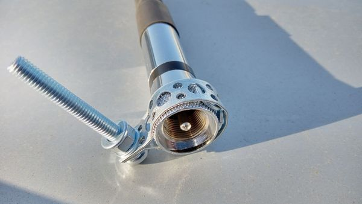
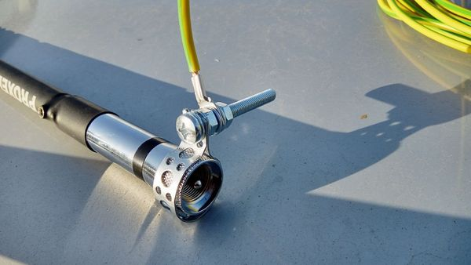

# Лайфхак швидкого заземлення без використання врізок на кабель

Беремо звичайний хомут та на корпус конектора фідера, далі шинкою до арматури або окремого контуру заземлення. 
Але, треба розуміти, що захист АФП та обладнання повинен бути комплексний та в першу чергу зі сторони антени, 
а не тільки трансивера.

**Перший нюанс**

Часто намагаються пристосувати розрядники або варистори, призначені для UTP кабелю (Інтернет), що неправильно. Насамперед потрібно визначитися яка потужність, що підводиться, планується і яка антена? Розрядник треба вибирати з напругою запалювання ~1.5 рази вище, ніж пікова напруга у фідері при КСХ трохи більше 1.5-2. Типові струми розрядників 100-200 кА. На менші струми найкраще схожий розрядник зі свічок запалювання без вбудованого псевдоопору. При цьому слід виставити розрядний проміжок трохи більшої потужності, що підводиться (для сухого повітря при нормальних умовах пробивне порядку 30кВ/см). І потім, якщо заземлюючий розрядник ставиться з боку антени, то потім просто необхідний запірний дросель з додатковим розрядником. Причина в тому, що при своєму спрацюванні розрядник з боку антени вирівняє потенціали на центральній жилі та оплетці з різницею на напругу підпалу та підтримку розряду. У результаті наведений імпульс блискавки стане синфазним для запорника, який ефективно ослабить його, але не до кінця.

**Другий нюанс**

Запірному дроселю з котушки фідера часто приписують функцію виключно симетруючого пристрою для придушення несиметричних струмів і синфазних перешкод при живленні симетричних антен несиметричним фідером. Але він є ефективним елементом комплексного захисту від наведених iмпульсiв вiд блискавки, оскільки для швидкоплинних імпульсів струму (характерних для розрядів) дросель (кілька витків з кабелю) являє собою великий реактивний опір.

**_У комплексі слід дотримуватися наступних заходів захисту:_**

1. Заземлення щогли
2. Короткозамкнена антена
3. Запірний дросель індуктивністю не менше 50uH для високого реактивного опору розрядним імпульсам і розрядники біля антени і після запорника
4. Використання фідерного кабелю з перетином оплетення не менше 10 квадратів
5. Заземлення з боку апаратури
7. Відключення АФП із достатнім віддаленням від металевих труб опалення

Література

1. [Введення від Віктора Пащенка "Блискавкозахист. Повернення до основ](https://drive.google.com/open?id=1OoZ751gytxt7m8Bfk6IY5w4irTsGm4Jl)
2. [Принципи комплексного блискавкозахисту радіообладнання](https://drive.google.com/open?id=1pzikxAg4TH4etx8MOpjCPm-MvFaNJFBU)
3. [Влаштування блискавкозахисту будівель та споруд](http://www.portali.ho.ua/doc/dstu-b-v.2.5-38.2008-ua.pdf)
4. [Блискавозахист будинку](https://zandz.com/ru/molniyezashchita_doma.html)
5. Базелян. [Фізика блискавки та блискавозахисту](https://drive.google.com/file/d/13jOwe-FpvcTf6hNDfiviYEeVb2qPIK3-/view)

