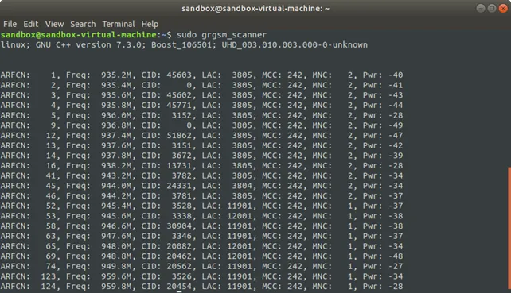
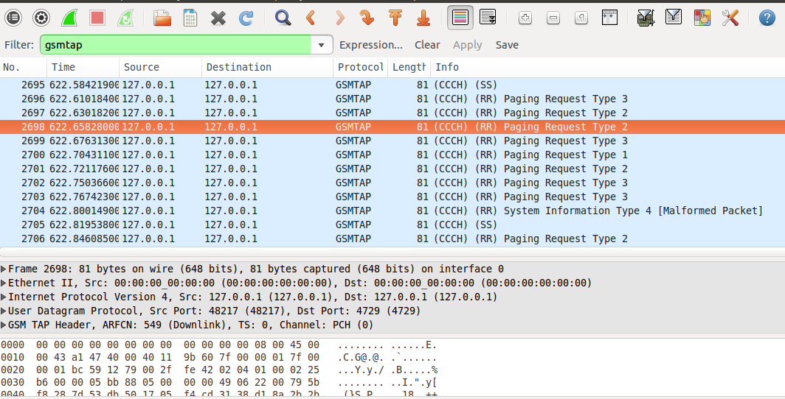

# Працюємо з gr-gsm і збираєм IMSI поряд

Джерело матеріалу: [Персональний блог UT3USW](https://ut3usw.dead.guru/docs/ham/gsm/gsm-start-and-imsi-cacth)

> Описаний лише пасивний варіант. Активний варіант буде доданий згодом окремою статтею.

## Необхідне залізо
* RTL-SDR або hackrf one
* антнена що хочаб якось приймає GSM 2G частоти
* комп'ютер з Linux

## Встановлення gnuradio

```bash
sudo add-apt-repository ppa: gnuradio/gnuradio-releases
sudo apt-get update
sudo apt-get install gnuradio
```
## Встановлення gr-gsm

**gr-gsm** — блоки та інструменти для GNU Radio, які обробляють трафік GSM

```bash
git clone https://gitea.osmocom.org/sdr/gr-gsm
cd gr-gsm
mkdir build
cd build
cmake ..
mkdir $HOME/.grc_gnuradio/ $HOME/.gnuradio/
make
```

```bash
sudo make install
sudo ldconfig
```

Більше можна прочитити тут: https://osmocom.org/projects/gr-gsm/wiki/Installation

## Перехоплюємо трафік GSM та збираємо IMSI

Першим хорошим кроком для того, щоб перевірити, чи все працює, є запуск команди sudo grgsm_scanner. З моменту запуску буде здійснено пошук та перелік усіх найближчих базових станцій. Це може зайняти близько хвилини, перш ніж Ви побачите станції.

```bash
#RTL-SDR
grgsm_scanner --band=GSM900  --gain=34 --speed=5 --args=rtl=0

#HackRF
grgsm_scanner --band=GSM900  --gain=40 --args=hackrf=0

```



Коди операторів (mnc) можна подививтись тут: https://mcc-mnc.com/

Виберіть базову станцію, з якої потрібно “сніфати” трафік. Потужність сигналу для цього вказана в крайній правій колонці. Числа, ближчі до нуля, представляють сильніший сигнал. Для цього прикладу я буду використовувати станцію на частоті 949,8 Мгц. Ви можете перехоплювати трафік за допомогою команди sudo grgsm_livemon -f 949.8M.

Щоб перевірити що у вас все точно ок можна запустити `sudo grgsm_livemon -f 949.8M` і побачити що в консолі відображається трафік у вигляді безкінечного потоку "байтіків". Якщо все ок, то можна переходити до наступного кроку. (не забудьте зупинити тут grgsm_livemon)

```bash
# RTL
grgsm_livemon_headless --fc 949.8M --gain 34 --args rtl=0

# HRF
grgsm_livemon_headless --fc 949.8M --gain 40 --args hackrf=0
```

Тепер можна запускати **Wireshark** з фільтром: `wireshark -k -Y '!icmp && gsmtap' -i lo &`



Тепер можете шукати пакет `e212.imsi` і там все буде.

Також можна запустити `python3 simple_IMSI-catcher.py` з пакету https://github.com/Oros42/IMSI-catcher

Джерело матеріалу: [Персональний блог UT3USW](https://ut3usw.dead.guru/docs/ham/gsm/gsm-start-and-imsi-cacth)
