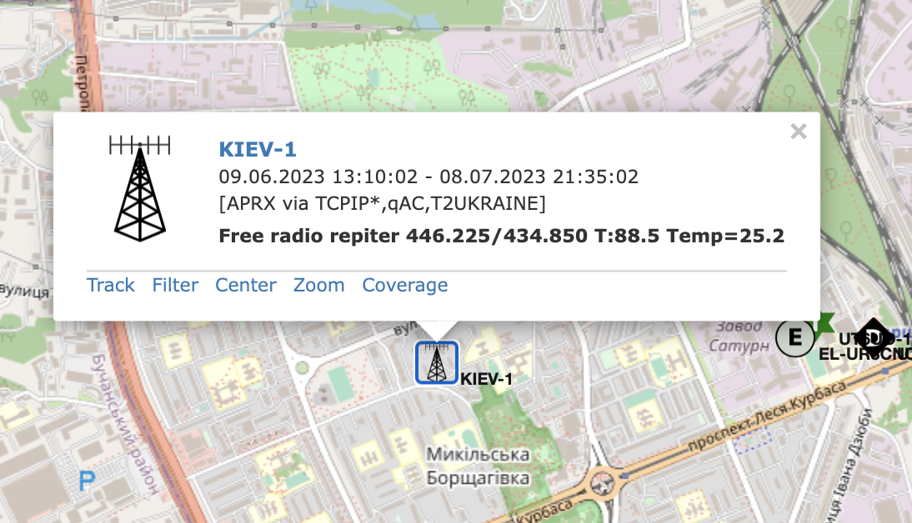
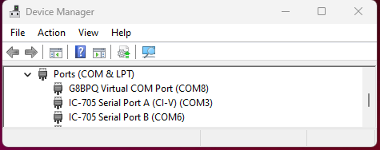
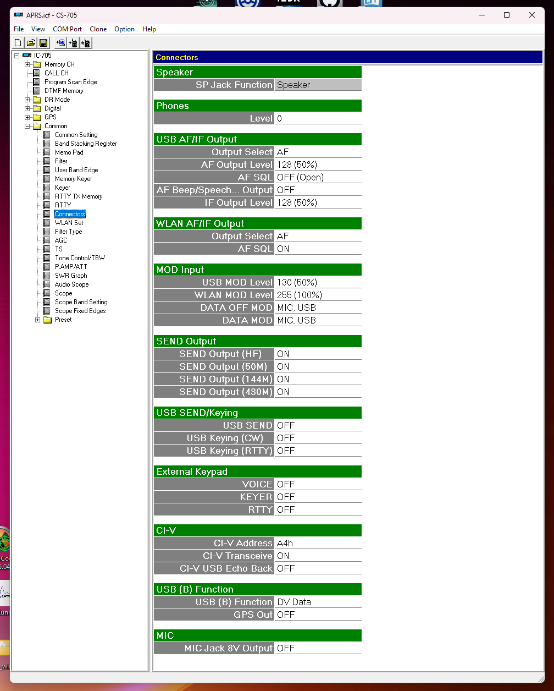
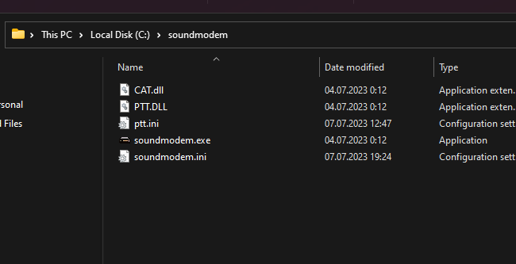
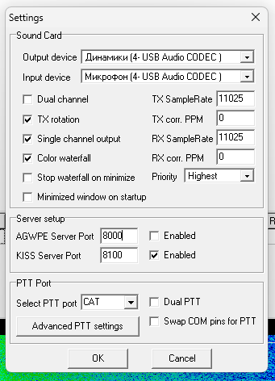
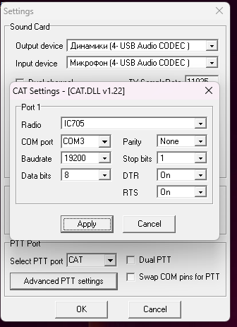
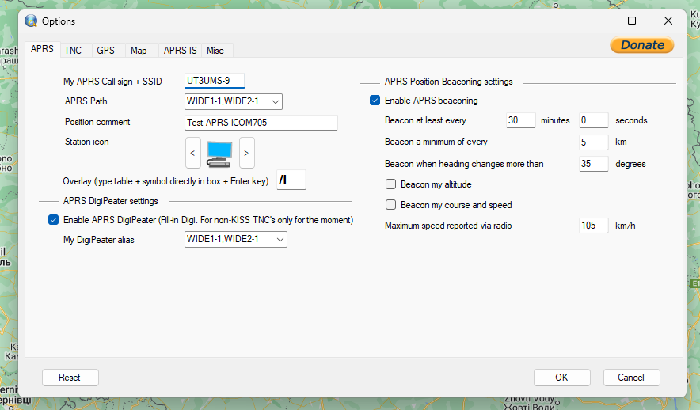
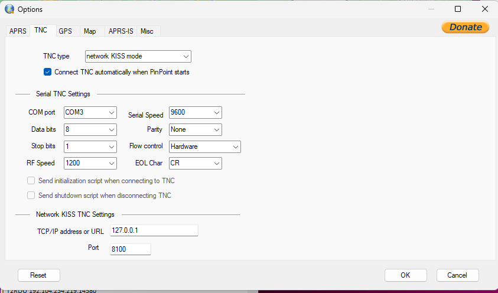
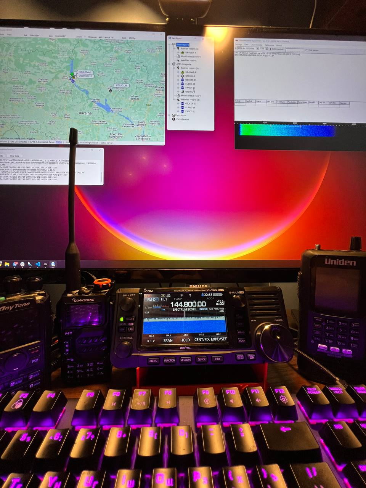

# APRS на ICOM IC-705

Джерело матеріалу: [Персональний блог UT3USW](https://ut3usw.dead.guru/docs/ham/icom-705-aprs)

## Вступ

**APRS** (Automatic Packet Reporting System) є системою передачі даних, яка використовується в радіозв'язку для відстеження та обміну інформацією з мобільними, стаціонарними та портативними радіостанціями. APRS був розроблений Бобом Брунінгою, [WB4APR](http://www.arrl.org/news/aprs-developer-bob-bruninga-wb4apr-sk), і став популярним серед радіоаматорів.

Система **APRS** використовує пакетну комутацію даних, де короткі пакети інформації відправляються через радіохвилі на вказані радіостанції в режимі реального часу. Ці пакети можуть містити різноманітну інформацію, таку як координати місцезнаходження, швидкість, напрямок руху, стан погоди, повідомлення тощо.

## Icom IC-705

Трансівер не підтримує роботу з APRS напряму. Тому для роботи з APRS потрібно використовувати додаткове програмне забезпечення для генерації та декодування сигналів APRS. IC-705 має бути підключеним до комп'ютера на Windows через USB. Не забудьте втсановити драйвери для USB, їх можна скачати на офіційному сайті [Icom](https://www.icomjapan.com/support/firmware_driver/3768/). Встановіть драйвери і перезавантажте комп'ютер. Після перезавантаження ви побачите два нових COM порти в диспетчері пристроїв.

Також разом з новими COM портами ви побачите новий звуковий пристрій для отримання і передачі звуку між ПК і трансивером. Важливо вірно налаштувати ваш Icom для вірної роботи з аудіо.

Також додаткові відомості і трабшутінг описаний тут: [h_r_d_trouble.pdf](https://assada.dead.guru/storage/images/h_r_d_trouble.pdf)

Теоритично на цьому етапі ваш трансивер може передавати і приймати аудіо прямо з ПК. Типу після "нажимання" тангенти можна транслювати ютьюб в ефір. Але нашо нам це? Давайте налаштуємо APRS.

## Налаштування APRS

Фішка в тому що не існує APRS програмного забеспечення що може по COM порту передавати і приймати APRS пакети (для Icom). Тому вище ми налаштували умовний "USB COM VOX" режим. APRS клієнт [PinPoint](https://www.pinpointaprs.com/) дозволяє працювати по [KISS TNC](https://en.wikipedia.org/wiki/KISS_(amateur_radio_protocol)) протоколу через мережу. Узагалі, KISS TNC надає простий спосіб передачі даних між комп'ютером і радіостанцією в рамках пакетного радіозв'язку, забезпечуючи низький рівень складності і простоти використання.

Схема яку ми налаштужмо виглядає так:

.png)

1. Качаєм і встановлюємо PinPoint APRS. [Скачати](https://assada.dead.guru/storage/images/pin_point_v2_build_230511.zip)
2. Качаєм і встановлюємо SoundModem. [Скачати](https://assada.dead.guru/storage/images/soundmodem114.zip) (Це буде наш KISS TNC сервер для роботи між рацією і PinPoint)
3. Качаєм PTT бібліотеку для SoundModem [Скачати](https://assada.dead.guru/storage/images/ptt-dll.zip) цей архів розпаковуємо в папку з SoundModem.

CAT PTT бібліотека дозволить налаштувати PTT (Push To Talk) функцію для SoundModem для Icom.

### Налаштування SoundModem

Запускаємо SoundModem і відкриваєм *Settings > Devices*. Тут обов'язково обираєм input і output пристрої Icom! Ставимо **галочку** напроти *KISS Server Port*. В полі *Select PTT port* обираємо **CAT**.

Жмакаєм на *Advanced PTT settings*

Тут ми налаштовуємо "віртуальну тангенту" для нашого ресівера. По скріншоту, я думаю все зрозуміло.

> **Важливо!** в вікні Advanced PTT settings оберіть той COM порт що в Диспетчері Пристроїв відображається як "CI-V"!

Загалом налаштування SoundModem завершено. Ви маєте побачити waterfall і навіть вже можете отримувати APRS пакети прямо в вікні SoundModem.

### Налаштування PinPoint APRS

Запускаємо PinPoint APRS жмакаємо клавішу F2 відкриється вікно налаштувань. Заповнюємо свій позивний і інші данні APRS.

Далі нас цікавить вкладка *TNC*. Тут ми налаштовуємо підключення до SoundModem. Оберіть *TNC Type* як network *KISS mode*. і змініть порт на 8100 (або на той що вказували в SoundModem). Serial TNC можна ігнорувати.

Закриваєм налаштування жмем *Options -> Connect TNC* в статуст панелі маємо побачити статус *Connected to TNC* чи щось подібне.

От і все! Тепер можна передавати та отримувати APRS пакети через радіо.

### P.S
В мене були певні проблеми що PinPoint успішно підключався до SoundModem, отримував пакети по радіо, але чомусь не міг передати пакети. Вирілось саме по собі =) WireShark не показав якихось мережевих проблем між PinPoint і SoundModem. Якщо у вас така ж проблема, спробуйте перезапустити компютер.

Також корисним для діагностування проблем ПЕРЕДАЧІ корисним буде послухати на слух що ж там передає трансівер в ефір. Бо через не вірну конфігурацію аудіокарти в SoundModem в ефір передавалась тиша. Тиша також передавалась при не вірних налаштуваннях Icom.

Джерело матеріалу: [Персональний блог UT3USW](https://ut3usw.dead.guru/docs/ham/icom-705-aprs)
