# Meshtastic в Україні

Матеріал використано з дозволу UT3USW

Джерело матеріалу: [Персональний блог UT3USW](https://ut3usw.dead.guru/docs/ham/meshtastic)

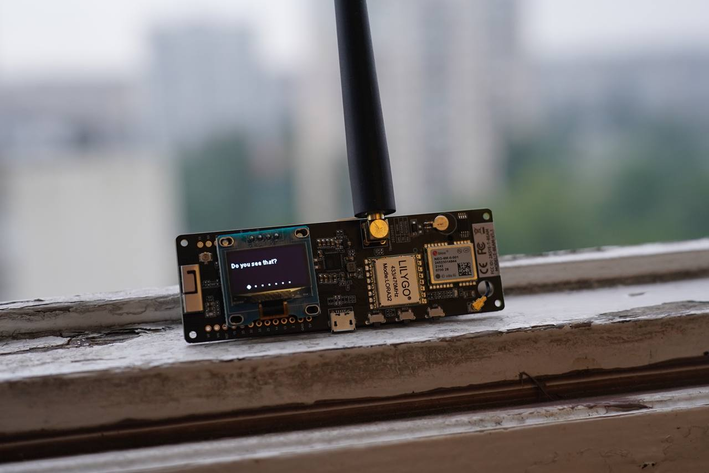

**Meshtastic** — це проект, який дозволяє використовувати недорогі трансивери на базі LoRa як дальньобійну комунікаційну платформу в зонах без наявної або ненадійної комунікаційної інфраструктури.

Основна технологія, **LoRa**, — це радіопротокол великої дальності, доступний для більшості регіонів без додаткового ліцензування чи сертифікації.

Радіостанції автоматично ретранслюють отримані повідомлення, щоб створити розподілену меш мережу, щоб усі в групі могли отримувати повідомлення – навіть від найдальшого учасника. Залежно від налаштувань, що використовуються, **Meshtastic** меш може підтримувати до 80 вузлів пристроїв (але загалом, можливо і більше).

Радіостанції **Meshtastic** можна з’єднати з одним телефоном, щоб ваші друзі та родина могли надіслати повідомлення на вашу конкретну радіостанцію. Кожен пристрій підтримує підключення від одного користувача одночасно.

### Особливості
* Велика дистанція зв’язку [(рекорд 206км)](https://meshtastic.discourse.group/t/practical-range-test-results/692/130)
* Для зв’язку телефон **не обов’язковий**
* Децентралізований зв’язок - єдиний маршрутизатор не потрібен
* **Зашифроване** спілкування
* Відмінний час автономної роботи (залежить від пристрою, але програмно закладена енергоефективність)
* Додаткові функції визначення місцезнаходження на основі GPS (можна вимкнути, або надсилати фейкову локацію)
* **І більше!**

[TOC]

## Історія появи технології LoRa.

На початку 2015 року [Semtech Corporation](https://www.semtech.com/) та дослідницький центр [IBM Research](https://research.ibm.com/) представили новий відкритий енергоефективний мережевий протокол LoRaWAN (Long Range Wide Area Networks), що забезпечує значні переваги перед Wi-Fi та стільниковими мережами завдяки можливості розгортання міжмашинних (M2M) комунікацій, чи сколихнули ринок IoT.

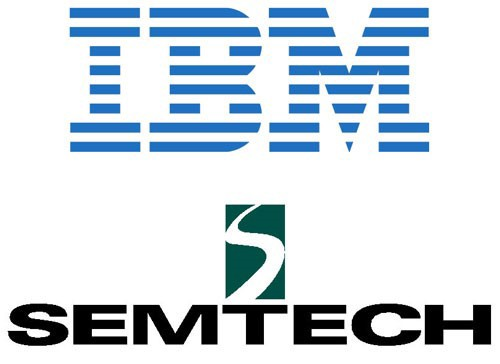

Технологія **LoRa** з’явилася на світ під егідою некомерційної організації [LoRa Alliance](https://lora-alliance.org/), заснованої такими компаніями, як IBM, Semtech, Cisco та ін., з метою прийняття та просування протоколу LoRaWAN як єдиний стандарт для глобальних мереж з низьким енергоспоживанням (LPWAN — від англ. Low Power Wide Area ).

Розробники **LoRa Alliance** позиціонують **LoRa** як технологію, що має значні переваги перед стільниковими мережами та WiFi завдяки можливості розгортання міжмашинних (M2M) комунікацій на відстанях до 20 км (правда рекорди дальності вже білше за 800км). та швидкостях до 50 Кбіт/с., при мінімальному споживанні електроенергії, що забезпечує кілька років автономної роботи на одному акумуляторі типу АА.

Діапазон застосування даної технології величезний: від домашньої автоматизації та інтернету речей до промисловості та розумних міст.

В нашому, реальному, житті LoRa використовується, наприклад: для взаємодії розумних елементів міста (автоматичне освітлення в містах України), для військових потреб ([Проект ComBat Vision](https://combat.vision/) використовує Mashtastic для синхронизації пристроїв в своїй системі).

:::info Інформація
Meshtastic **не є** LoRaWAN. Meshtastic використовує повний спектр частот, призначений для технології LoRa для кожного регіону. Це дозволяє використовувати кілька сотень можливих частотних каналів.
:::


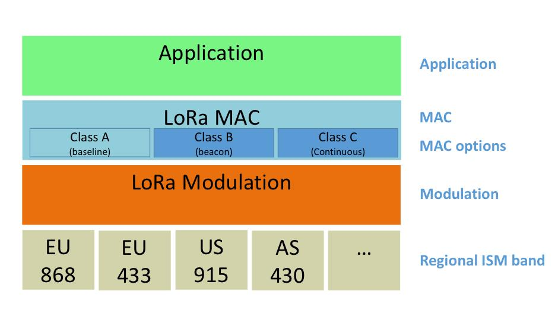

## Що таке Meshtastic?

**Meshtastic** — це "LoRa based" проект, який дозволяє використовувати недорогі GPS-радіостанції *трансивери* (30 баксів плюс-мінус) як розширюваний меш GPS-комунікатор із надтривалим терміном служби батареї. Ці трансивери чудово підходять для піших прогулянок, катання на лижах, велоспорту – практично для будь-якого хобі, де у вас немає надійного доступу до Інтернету. Кожен учасник вашої приватної мережі завжди може бачити місцезнаходження та відстань усіх інших учасників, а також будь-які текстові повідомлення, надіслані у ваш груповий чат або писати вам особисто через приватні повідомлення.

Радіостанції автоматично створюють і підтримують мережу LoRa для пересилання пакетів у разі потреби(до 7 хопів), тому кожен у групі може отримувати повідомлення навіть від найдальшого учасника. Радіостанції за бажанням працюватимуть із вашим телефоном, але телефон не обовя`зковий.

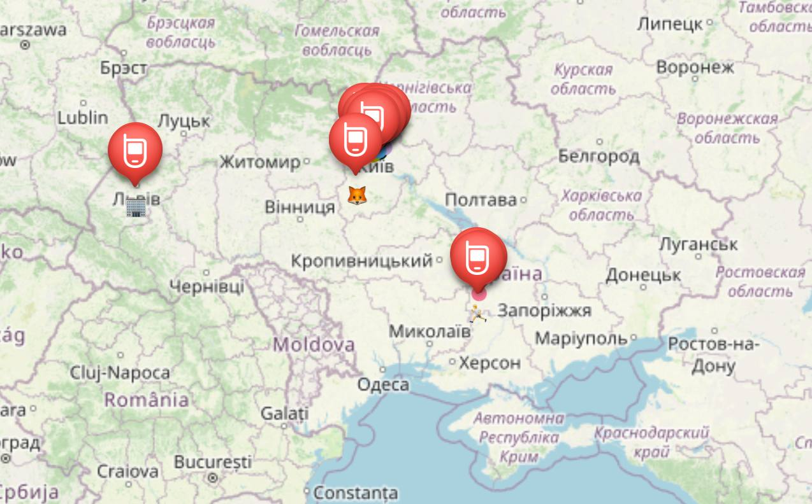

**Основна функція проекту:** передача тексту та ваших координат через смартфон без використання стільникового зв’язку та інтернету.

Тобто. на ваш смартфон Android або iOS, встановлюється програма Meshtastic. Це програма-чат на зразок Telegram або Viber. Телефон з’єднується з радіомодемом через Btuetooth. Через радіомодем здійснюється зв’язок з іншими абонентами, у яких стоїть така сама програма і такий же модем. На екрані смартфона ви можете бачити список абонентів та карту їх розташування. Ви бачите груповий чат та p2p чати з учасниками мережі.

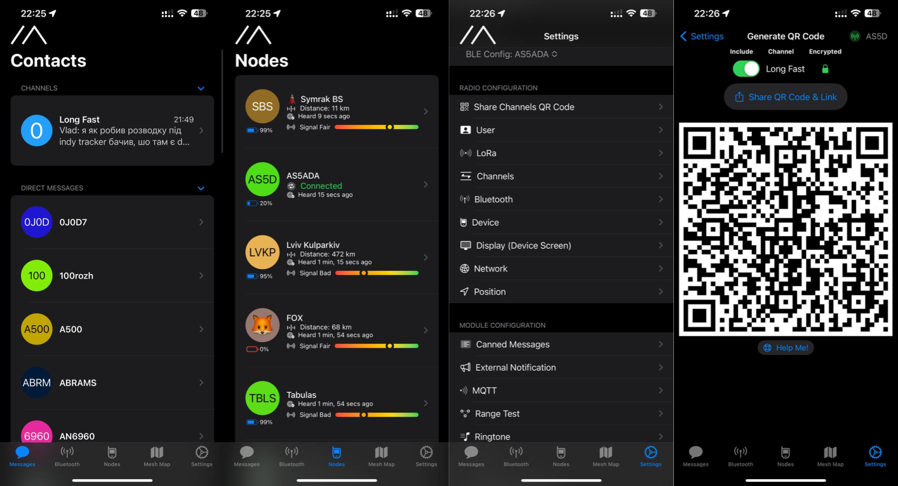

**Варіанти сценаріїв застосування:**

* Екстрений цифровий зв’язок при надзвичайних ситуаціях (наприклад відключення світла)
* Пошук втрачених людей
* Створення своєї радіомережі серед однодумців усередині свого району і навіть далі, що самоорганізується, у своєму власному проекті
* Передача легкої телеметрії, наприклад, з власної метеостанції, показання дозиметру чи іншого датчика
* Спорт на відкритому повітрі з обмеженим покриттям мобільного зв’язку. (Піші прогулянки горами, катання на лижах, катання на човнах, парапланеризм або квадрокоптери, і т. д.)
* Ситуації, в яких GPS-комунікатори із закритим вихідним кодом просто не допоможуть (легко додати функції для пілотів квадрокоптерів або планерів і т.д.)
* Безпечний зв’язок на великій відстані всередині груп, незалежно від стільникових операторів

**Необхідне апаратне забезпечення для роботи з Meshtastic:**

* Android/iOS cмартфон або комп’ютер для налаштувань і спілкування в чаті
* Meshtastic – радіомодем на основі LoRa-модулів зв’язку *про це далі*
* антена. Краща антена – кращий зв’язок. **Комплектної антени може вистачити** Читайте про це нижче.
* Li-Ion акумулятор або PowerBank для живлення модулю

Радіомережа будується на основі готових LoRa-радіомодулів. Головна особливість їх полягає у великій дальності зв’язку за дуже мізерної потужності. В Україні виділено під LoRa ділянки частот 433МГц. Саме під цю частоту вам необхідно знайти або зібрати модем і антену.

## Пристрої Meshtastic

Українська мережа розвивається на частоті **433МГц**. Тому **будьте уважні**! Замовляйте саме **433МГц** модулі якщо бажаєте доєднатися до загальнгої мережі.

Загальний список пристроїв, які підтримуються Meshtastic можна переглянути на офіційному сайті проекту: [https://meshtastic.org/docs/supported-hardware](https://meshtastic.org/docs/supported-hardware)

Є кілька варіантів радіомодемів, які [рекомендуються для використання в Українській мережі](https://wikimesh.pp.ua/uk/%D0%A0%D0%B5%D0%BA%D0%BE%D0%BC%D0%B5%D0%BD%D0%B4%D0%BE%D0%B2%D0%B0%D0%BD%D1%96_%D0%BF%D1%80%D0%B8%D1%81%D1%82%D1%80%D0%BE%D1%97):

* **LILYGO® TTGO LoRa32 V2.1_1.6 T-Lora** — найдешевший, без GPS і не великою потужністю передачі. https://a.aliexpress.com/_Ev5JaUT

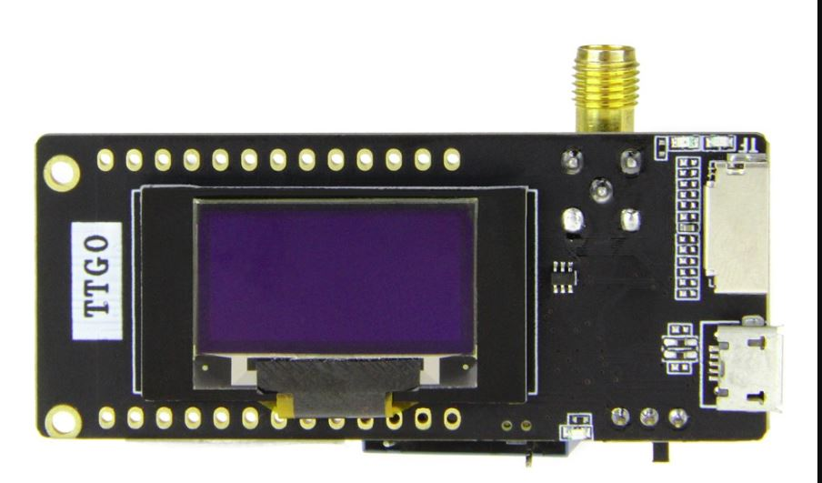

* **LILYGO® T-Beam** — самий популярний пристрій. Вже з GPS і більшою потужністю передачі. https://www.aliexpress.com/item/4001286458852.html

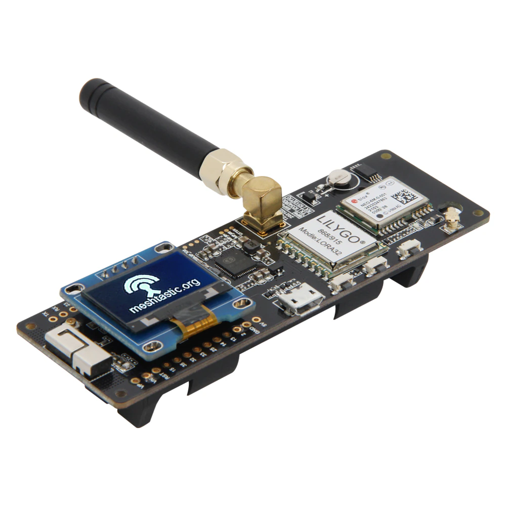

* **LILYGO® TTGO Meshtastic T-Echo** — лакшері варіант. Найкраща потужність, енергоефективний дисплей, вбудований датчик температури і вологості. https://www.aliexpress.com/item/1005003026107533.html

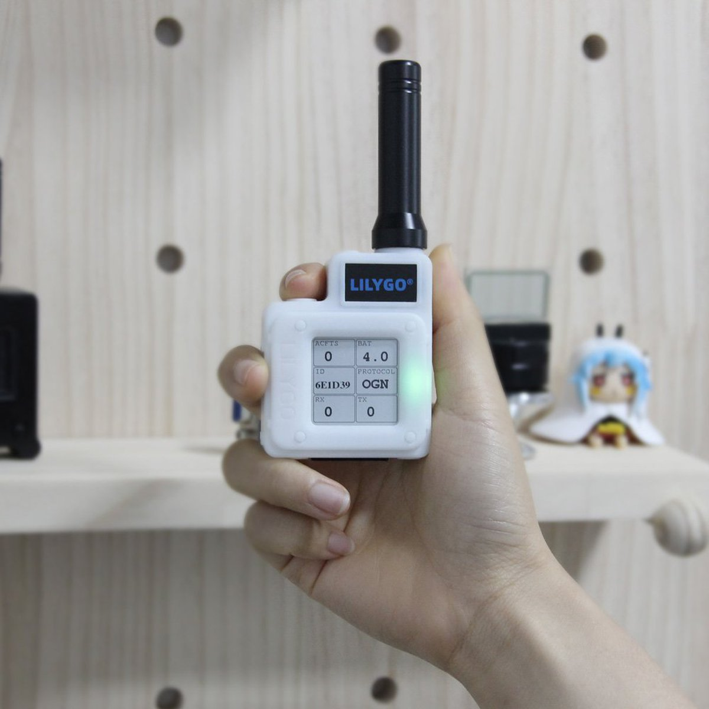

### Прошивка пристроїв

Для себе я обрав саме **LILYGO® T-Beam** як найбільш збалансований по ціні і кількості функцій.
Отримавши модуль перше що треба зробити — оновити прошивку модему до останньої версії. Зробити це можна двома способами: простим через web інтерфейс і умовно складним, через esptool.
Вам можуть знадобитися драйвера для serial-чіпу ch9102: https://github.com/WCHSoftGroup/ch343ser_linux

:::warning Зверніть увагу!
Драйвер не підтримує версію ядра >= 6.1. Але ви можете застосувати відповідні патчі. Наприклад https://github.com/WCHSoftGroup/ch343ser_linux/commit/0c08ee45b25ca93d2c213e18f881627849094268.patch
:::

#### Прошивка через web інтерфейс

1. Підключаємо пристрій до комп’ютера через USB
2. Відкриваємо https://flasher.meshtastic.org/ і виберіть прошивку, яку потрібно завантажити на Meshtastic , та виберіть COM порт, до якого підключений ESP32.
3. Натисніть кнопку "Flash" у веб-флешері. Процес прошивки може зайняти кілька хвилин.
4. Після завершення прошивки пристрій перезавантажиться.

#### Прошивка через Visual Studio Code (Platformio)


**Підготовка**

1. Встановіть Visual Studio Code (https://code.visualstudio.com/)
2. Встановіть PlatformIO (https://platformio.org/platformio-ide)
3. Зклонуйте прошивку: `git clone https://github.com/meshtastic/firmware.git`
4. Встановіть необхідні модулі: `cd firmware && git submodule update --init`

**Прошивка**

1. Відкрийте папку з прошивкою в Visual Studio Code. І дочекайтесь поки PlatformIO встановить всі необхідні бібліотеки
2. За допомогою панелі швидких команд `Ctrl + Shift + P` оберіть *PlatformIO: Pick Project Environment* і виберіть свій пристрій. Дочекайтесь поки PlatformIO завантажить необхідні бібліотеки
3. Далі запустсть *PlatformIO: Build* для збірки прошивки
5. І нарешті *PlatformIO: Upload* для завантаження прошивки на пристрій

Це найпростіший спосіб прошивки якщо ви плануєте використовувати модифікації описані нижче.

#### Прошивка через esptool (складний варіант)

Процес збірки і сам процес описаний **UT3UMS** тут: [tbeam-firmware-ut3ums.md](/docs/hardware/tbeam-firmware-ut3ums)

Додатково при виборі цього способу прошивки модему можна реалізувати наступне:
* Українська мова на екрані пристрою: [https://wikimesh.pp.ua/uk/налаштування/Увімкнення_Української_мови](https://wikimesh.pp.ua/uk/%D0%BD%D0%B0%D0%BB%D0%B0%D1%88%D1%82%D1%83%D0%B2%D0%B0%D0%BD%D0%BD%D1%8F/%D0%A3%D0%B2%D1%96%D0%BC%D0%BA%D0%BD%D0%B5%D0%BD%D0%BD%D1%8F_%D0%A3%D0%BA%D1%80%D0%B0%D1%97%D0%BD%D1%81%D1%8C%D0%BA%D0%BE%D1%97_%D0%BC%D0%BE%D0%B2%D0%B8)
* Збільшення потужності [https://wikimesh.pp.ua/uk/налаштування/Збільшення_потужності](https://wikimesh.pp.ua/uk/%D0%BD%D0%B0%D0%BB%D0%B0%D1%88%D1%82%D1%83%D0%B2%D0%B0%D0%BD%D0%BD%D1%8F/%D0%97%D0%B1%D1%96%D0%BB%D1%8C%D1%88%D0%B5%D0%BD%D0%BD%D1%8F_%D0%BF%D0%BE%D1%82%D1%83%D0%B6%D0%BD%D0%BE%D1%81%D1%82%D1%96)
* Розширене логування RadioLib через Serial [https://wikimesh.pp.ua/uk/налаштування/Розширене_логування_RadioLib](https://wikimesh.pp.ua/uk/%D0%BD%D0%B0%D0%BB%D0%B0%D1%88%D1%82%D1%83%D0%B2%D0%B0%D0%BD%D0%BD%D1%8F/%D0%A0%D0%BE%D0%B7%D1%88%D0%B8%D1%80%D0%B5%D0%BD%D0%B5_%D0%BB%D0%BE%D0%B3%D1%83%D0%B2%D0%B0%D0%BD%D0%BD%D1%8F_RadioLib)

### Перші налаштування і підключення до мережі

T-Beam і інші модеми з підтримкою Bluetooth можуть бути налаштовані з додатку. Але цей спосіб, особисто в мене, працює погано. Тому я обрав варіант використання meshtastic cli утиліти(клієнту).

Також варто зазначити, що ви можете налаштувати і працювати з модемом через web клієнт: https://client.meshtastic.org/

Якщо ви **новачаок** і подальші пункти цієї статті для вас складні, то вам краще використовувати web клієнт! Просто підєднайте модем по USB до комп’ютера і відкрийте веб конфігуратор! **Все просто!**

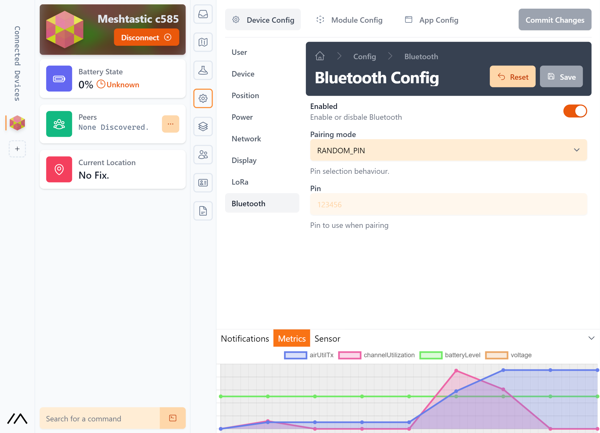

#### Встановлення meshtastic-cli

Вам потрібен python3 і pip > 20. Перевірте свої версії і оновіть за необхідності:

```bash
python3 --version
pip3 --version
```

Встановлюємо cli клієнт:

```bash
pip3 install --upgrade pytap2
pip3 install --upgrade meshtastic
```

Далі можна підключити модем до комп’ютера через USB і виконати наступну команду:

```bash
meshtastic --info
```

Таким чином ви перевірите що все працює.

#### Налаштування модему

Для початку роботи з модемом вам необхідно виконати наступні дії:

```bash
meshtastic --set-owner 'your node name' --set-owner-short  'NODE'
```

де `your node name` — це ваше ім’я в мережі, а `NODE` — це коротке ім’я, яке буде відображатися на екрані модему. Щось типу аватарки. Підтримується в тому числі і емодзі.

Встановлюємо налаштування радіо:

```bash
meshtastic --set lora.region EU_433 --set lora.modem_preset LONG_FAST
```

Після зміни кожного налаштування модем автоматично перезавантажиться. Параметри налаштувань можна об`єднувати в одну команду:

```bash
meshtastic --set-owner 'your node name' --set-owner-short  'NODE' --set lora.region EU_433 --set lora.modem_preset LONG_FAST
```

:::info Інформація про регіони

**EU_433** - працює на частотах 433.0-434.0МГц і лімітом потужності 12 dBm

**UA_433** - працює на частотах 433.0-434.7МГц і лімітом потужності 10 dBm


Список всіх регіонів і їх налаштувань можна переглянути в коді прошивки https://github.com/meshtastic/firmware/blob/v2.1.20.470363d/src/mesh/RadioInterface.cpp#L20-L121

або в документації https://meshtastic.org/docs/overview/radio-settings
:::


#### Підключення до мережі
Завантажте клієнт для вашої платформи https://meshtastic.org/downloads

І відскануйте QR код з налаштуваннями мережі.

Для IOS використовуйте QR сканер в додатку камери. Для Android використовуйте вбудований в додаток Meshtastic сканер в налаштуваннях каналів.


Вітаю! Ви в мережі! Спробуйте написати щось в чат і ви обов`язково отримаєте відповідь якщо ваш пакет хтось "почув". Якщо ні, то спробуйте змінити місцезнаходження або використати антену з більшим коефіцієнтом підсилення. Приклади антен наведені тут: [https://wikimesh.pp.ua/uk/Рекомендовані_антени](https://wikimesh.pp.ua/uk/%D0%A0%D0%B5%D0%BA%D0%BE%D0%BC%D0%B5%D0%BD%D0%B4%D0%BE%D0%B2%D0%B0%D0%BD%D1%96_%D0%B0%D0%BD%D1%82%D0%B5%D0%BD%D0%B8)

#### Що з антенами?
Якщо ви замовите з китаю T-Beam або T-Echo то в комплекті буде проста антена на **433МГц** *або на яку ви там частоту замовили модем*. Її може вистачити для зв"язку, а може ні. Залежить від вашої висоти, умов вашого розташування, дальності найближчого працюючого модему іншого учаснику мережі. Мені пощастило. Я живу на 13 поверсі і в мене модем просто валяється десь на столі з антеню від баофенгу і все працює чудово.

Якщо вам не пощастило з умовами то антену можна поступово покращувати! Базова антена продається в Україні на OLX за умовні 300-500 грн. Це все траба пробувати. Якщо ви не знаєте які антени краще то ви можете звернутися до нас в телеграм чаті і ми вам допоможемо з вибором. Але спочатку перевірте чи працює з базовою антеною.

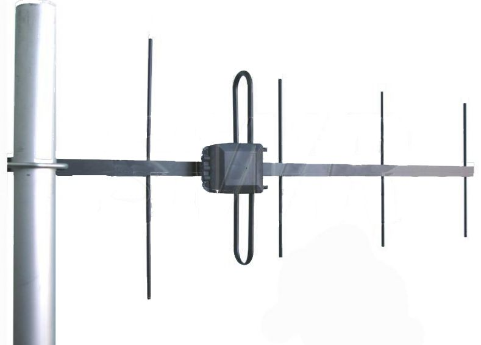

## TLDR;

Короче. Якщо ви нічо не зрозуміли але дуже хочеться спробувати то:

* Купити модем. T-Beam або T-Echo
* Скачати додаток для IOS/Android
* Підєднати модем до комп’ютера і налаштувати через https://client.meshtastic.org/
* Все!

:::info Простіше ніж ви думаєте
Зовсім не обов’язково використовувати cli утиліту чи займатися прошивкою. Пристрої приходять вже прошитими на якусь версію і її може виявитись достатьно. Антена, як написано вище, може виявитись теж не обов’язковою.
Всі питання ви можете задавати в телеграм чаті.
:::

## Модифікації прошивки

Декілька модифікацій по ввімкненю підтримки Української мови і збільшеню потужності передачі для декотрих версій чіпів описані тут: [https://wikimesh.pp.ua/](https://wikimesh.pp.ua/)

Але я додам ще кілька.

### Заміна SplashScreen на власний для T-Beam і подібних екранів

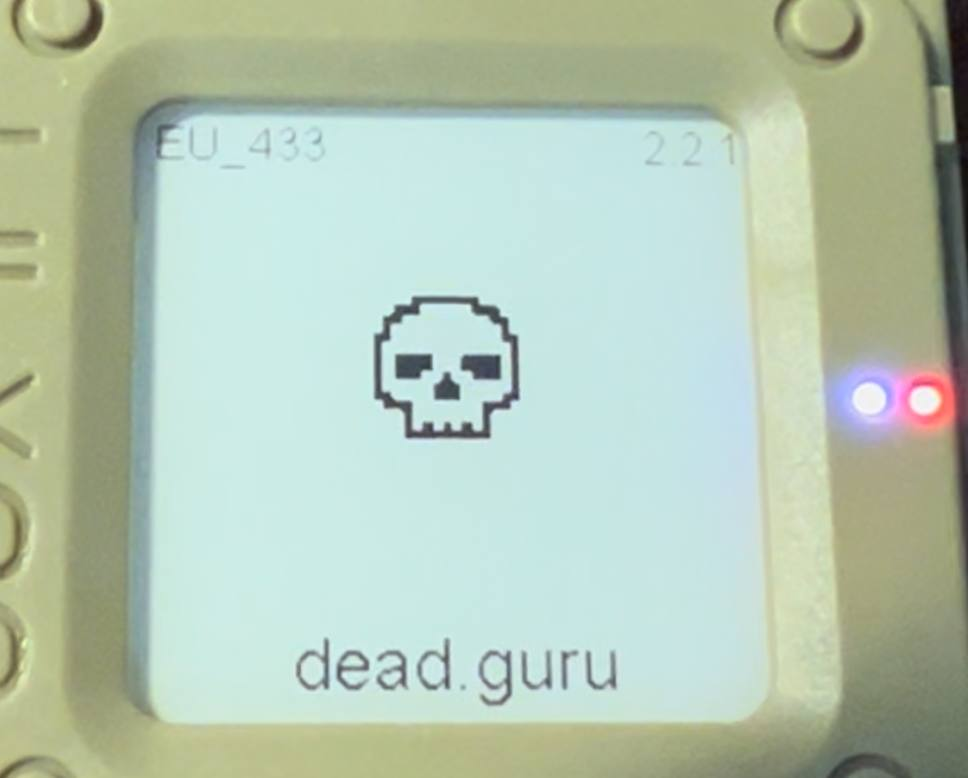

Файл XBM для заміни: `/firmware/src/graphics/img/icon.xbm`

Конвертор файлів в XBM https://windows87.github.io/xbm-viewer-converter/
Або тут можна помалювати: https://xbm.jazzychad.net/

Код копіюємо в файл `icon.xbm`, але уважно слідкуємо за назвами змінних і розмірами що задані для вашого пристрою (Поекспериментуйте з розмірами).


### Повний переклад прошивки

Для цього потрібно ввімкнути повну підтримку кирилиці. Зробити це можна в файлі `/firmware/variants/<variant>/platformio.ini` замініть `<variant>` на ваш пристрій додавши флаг збірки `-D OLED_UA`.

**Приклад для T-Beam:**

Файл `/firmware/variants/tbeam/platformio.ini`
```ini
; The 1.0 release of the TBEAM board
[env:tbeam]
extends = esp32_base
board = ttgo-t-beam
lib_deps =
  ${esp32_base.lib_deps}
// highlight-next-line
build_flags = ${esp32_base.build_flags} -D TBEAM_V10  -I variants/tbeam -D OLED_UA -DGPS_POWER_TOGGLE ; comment this line to disable double press function on the user button to turn off gps entirely.
upload_speed = 921600
```

Додатково всі тексти екрану можна замінити на українську тут `/firmware/src/graphics/Screen.cpp`. Але вистачає і просто підтримки української мови в шріфті.
Якщо все ж вирішити повністю перекласти прошивку, будьте уважні з кількістю символів. Я намагався перекладати так щоб кількість символів співпадала з англійсків варіантом. Інколи виходять не дуже зручні переклади.

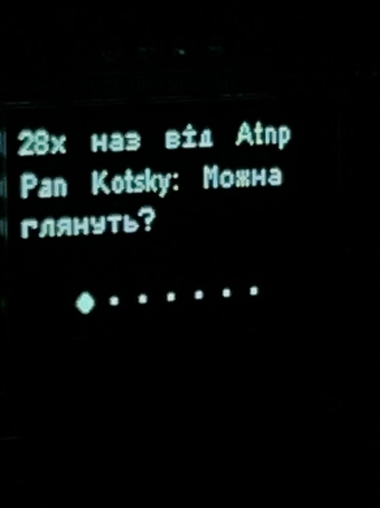

#### Підтримка української мови для T-Echo

EInk дисплей t-echo за замовчуванням використовує більший шрифт. 19 пікселів замість стандартних для oled 13. Але офіційна прошивка має тільки 13 піксельний варіант шрифту.

**Простий спосіб (зі зменшенням шрифту):**

В файлі `/firmware/src/graphics/Screen.cpp` знаходимо строку `#define FONT_SMALL ArialMT_Plain_16 ` десь між 105 і 110 рядком. І замінюємо на `#define FONT_SMALL ArialMT_Plain_10_UA`

Також варто додати флаг збірки `-D OLED_UA` в файл `/firmware/variants/t-echo/platformio.ini`

**Приклад:**

```ini
; First prototype eink/nrf52840/sx1262 device
[env:t-echo]
extends = nrf52840_base
board = t-echo
debug_tool = jlink

# add -DCFG_SYSVIEW if you want to use the Segger systemview tool for OS profiling.
// highlight-next-line
build_flags = ${nrf52840_base.build_flags} -D OLED_UA -Ivariants/t-echo -L "${platformio.libdeps_dir}/${this.__env__}/BSEC2 Software Library/src/cortex-m4/fpv4-sp-d16-hard"
build_src_filter = ${nrf52_base.build_src_filter} +<../variants/t-echo>
lib_deps =
  ${nrf52840_base.lib_deps}
  https://github.com/meshtastic/GxEPD2#afce87a97dda1ac31d8a28dc8fa7c6f55dc96a61
  adafruit/Adafruit BusIO@^1.13.2
  lewisxhe/PCF8563_Library@^1.0.1
;upload_protocol = fs
```

**Складний спосіб (зі ЗБЕРЕЖЕННЯМ розміру шрифту)**

Для цього способу нам потрібно змінити шрифт на кастомний (я намагався зробити його найбільш гарним).
Константа зі шрифтом: https://gist.github.com/assada/8ab477d67653690842c2328faeb19a88

Цю константу треба змінити в файлі `/firmware/.pio/libdeps/t-echo/ESP8266 and ESP32 OLED driver for SSD1306 displays/src/OLEDDisplayFonts.cpp` **після** запуску *Platformio: Pick Project Environment* вибрати `t-echo`. Інакше цього файлу може не бути!

Зміни в `/firmware/src/graphics/Screen.cpp` ми не робимо. Лише додаємо флаг збірки `-D OLED_UA` в файл `/firmware/variants/t-echo/platformio.ini` (описано вище)

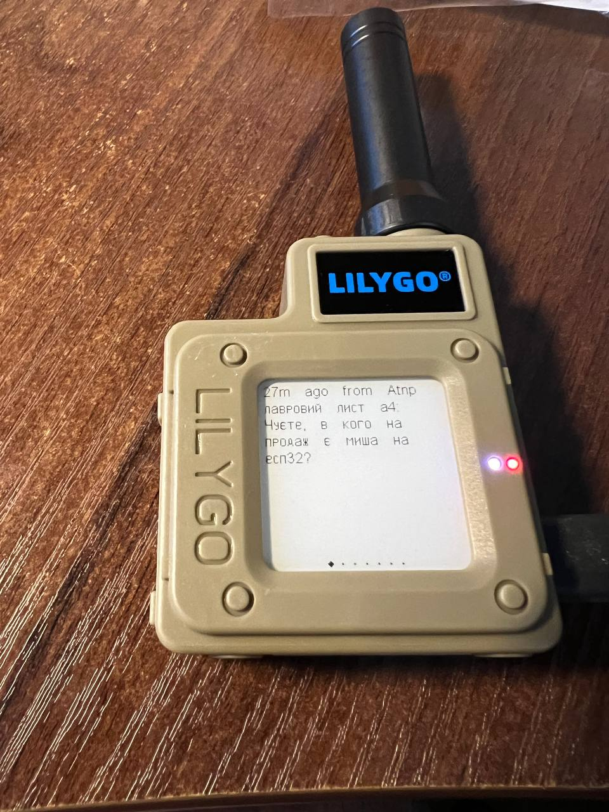

## Корисні посилання

* https://wikimesh.pp.ua/uk/home — Українська документація
* https://meshtastic.org/ — основний сайт проекту
* https://t.me/meshtastic_ua — Українська спільнота в Telegram
* https://mesh.0x21h.net — карта покриття (beta)
* https://mesh.in.ua/grafana/d/R4RChebVk/mesh?orgId=1&refresh=5s - Дашборд мережі
* https://t.me/meshtastic_lviv — спільнота міста Львів
* https://t.me/meshtastic_ua_chernivtsi — спільнота міста Чернівці
* https://t.me/meshtastic_ua_odesa — спільнота міста Одеса

Джерело матеріалу: [Персональний блог UT3USW](https://ut3usw.dead.guru/docs/ham/meshtastic)
