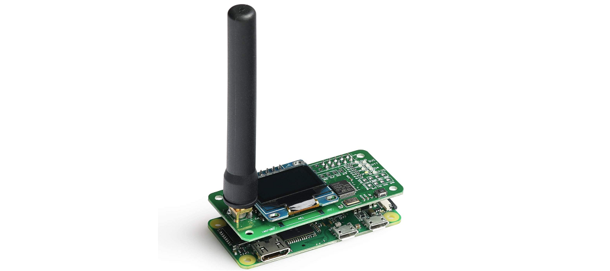
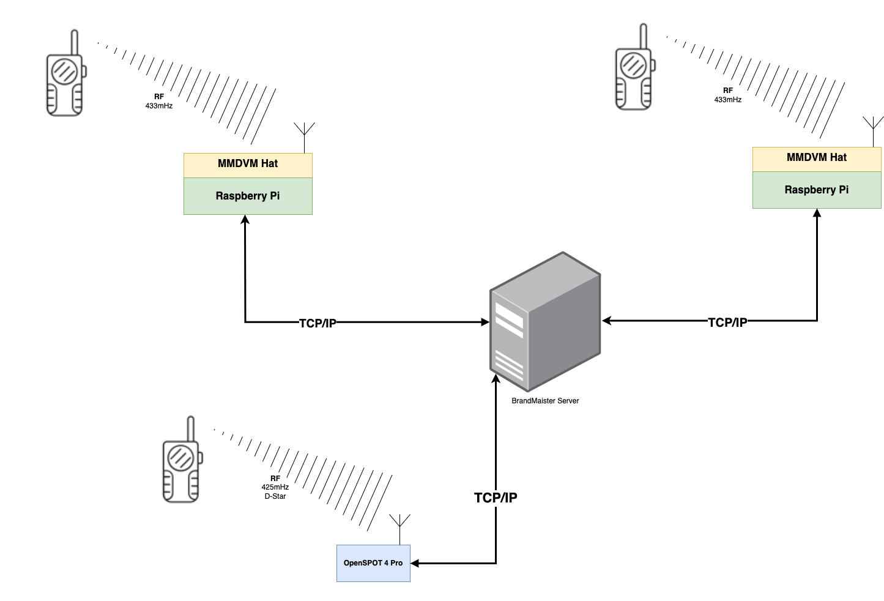
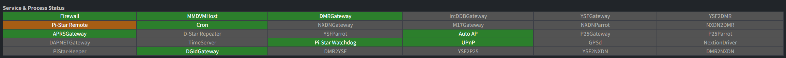
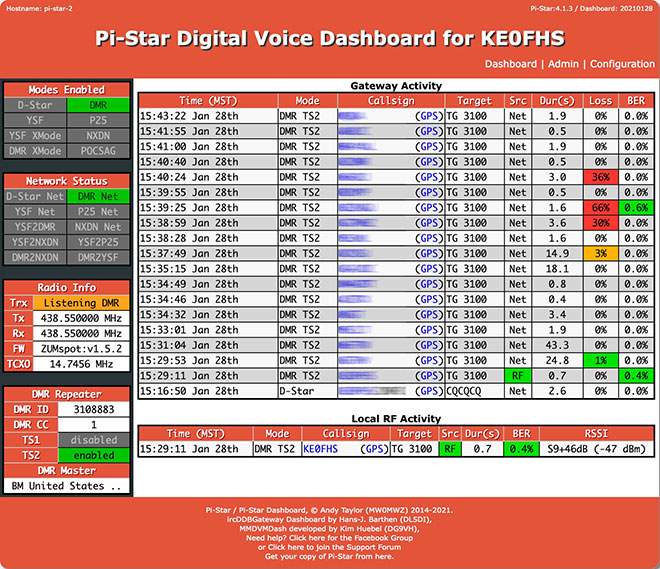

# Що за MMDVM та PI-Star?

Джерело матеріалу: [Персональний блог UT3USW](https://ut3usw.dead.guru/docs/ham/pi-star-and-mmdvm)

:::note

Вся інформація нижче потребує ознайомлення з радіоаматорськими термінами та термінами звязаними з цифровими радіосистемами. Достатньо знати на базовому рівні про [DMR](https://en.wikipedia.org/wiki/Digital_mobile_radio).

:::

DMR, D-STAR, YSF, P25 — радіоаматори дуже полюбляють дивні абрівеатури. *MMDVM* — одна з них. Це те що вам допоможе обєднати всі ці різні цифрові радіосистеми в одну. Інша абрівеатура — *PI-Star* — це програмне забезпечення для Raspberry Pi, яке дозволяє використовувати MMDVM.

> Без радіоаматорської ліцензії можна але складно і не треба та будьте уважні — використовуйте лише приватні мастер сервери. Якщо ви HAM боярин то ви знаєте що робити.

## Що таке MMDVM?

**MMDVM** (Multi-Mode Digital Voice Modem) — це апаратний модуль, який дозволяє використовувати одну антену для всіх цифрових режимів. Він приймає цифровий сигнал з радіостанції, перетворює його в цифровий сигнал, який можна передавати по Інтернету, а потім знову перетворює його в цифровий сигнал, який можна передавати по радіо.



Це карманний low-power персональний хотспот\репітер який надає вам цифровий зв"язок різних "модів" (режимів) з будь-якої точки світу, де є доступ до Інтернету.

З фізичної точки зору найдешевший хотспот (JumboSPOT) містить передавач ADF7021 з можливим діапазоном частот 80-940 МГц, STM32 та невелику антену. JumboSPOT встановлюється на Raspberry Pi Zero W. Це найбільш доступний варіант для використання в домашніх умовах. Також є купа різних більш дорогих і зручних варіантів, що мають вбудований GPS для APRS, LTE для доступу до Інтернету, а також вбудований дисплей.

Існують як сімплексні так і дуплексні модеми. Для домашнього використання і швидкого старту достатньо придбати сімплексний модем і підключити його до Raspberry Pi Zero W.

### Короткий юзкейс використання MMDVM:

У вас є DMR (наприклад [hardware/anytone-d878uvII](/docs/hardware/anytone-d878uvII)) рація та у вашого друга з іншої країни є YSF рація. Ви хочете звязатися з ним. Що ви робите?

Купуєте MMDVM, RPI, втановлюєте pi-star. Налаштовуєте pi-star для зєднання з одним мастер сервером*(Про це далі)* в інтернеті і вільно спілкуєтесь з вашим другом чи іншою групою людей. MMDVM встановлений на Raspberry Pi Zero W, який підключений до вашого домашнього роутера або до хотспота Wifi на вашому телефоні. Це реально пррацює так просто.

### Мастер сервери



У наведеній вище схемі всі спілкуються між собою через мастер сервер. Незалежно від того де вони географічно знаходяться, які частоти чи моди використовують.

Короче кажучи і дуже спрощуючи ви передаєте свій цифровий сигнал рації (DMR, YSF, D-STAR та інші) на якийсь сервер в інтернеті. На сервері створені і організовані talk групи де учасники мережі спілкуються. Це називається мастер сервер.

Основний і найбільший мастер сервер це **BrandMeister** https://brandmeister.network Ви також можете створити власний мастер сервер, наприклад, використовуючи HBlink3 https://github.com/lz5pn/HBlink3.

Ось декілька інших sellf-hosted мастер серверів для DMR/YSF/D-STAR:
* https://github.com/carpaldolor/DMRServer
* https://github.com/USA-RedDragon/DMRHub
* https://github.com/w9zep/Crazy-Horse-DMR-Server
* https://github.com/hp3icc/Easy-FreeDMR-Docker

Дивись нижче список корисних посилань.

## Що таке PI-Star?

**PI-Star** (https://www.pistar.uk/) це система управління MMDVM хотспотом для Raspberry Pi. Вона дозволяє вам налаштувати MMDVM для використання з різними мастер серверами.

**PI-Star** включає, але не обмежуєтсья, великим списоком попередньо встановлених компонентів і графічну веб-панель для управління ними. Сама панель написана на PHP і здебільшого використовується для відображення данних та налаштування конфігураційних файлів. Всі інші компоненти це C\C++ програми, які виконуються в фоновому режимі.

### Основні компоненти



* **MMDVM Host** - Є частиною платформи MMDVM. Дозволяє підключатися до мереж: D-STAR, DMR, YSF, NXDN, P25...
* **APRS Gateway** - Шлюз APRS. Дозволяє підключатися до APRS мережі.
* **DstarRepeater** - Дозволяє використовувати пристрій як D-STAR точки доступу/ретранслятора.
* **ircDDBGateway** - Шлюз Дозволяє підключатися до мережі D-STAR.
* **TimeServer** - транслює час для D-STAR.
* **DMR Gateway** - Шлюз Дозволяє підключатися до мережі DMR.
* **YSF Gateway** - Шлюз Дозволяє підключатися до мережі YSF.
* **YSF2DMR** - Є програмним перекодировщиком з YSF. Дозволяє підключатися до мережі DMR використовуючи YSF.
* **DMR2YSF** - Є програмним перекодировщиком з DMR. Дозволяє підключатися до мережі YSF використовуючи DMR.
* **Pi-Star Remote** - Дозволяє керувати хотсоптом по рідо каналу.

Керувати **Pi-Star** по радіо каналу потрібно лише в зоні впевненого прийому, щоб гарантувати виконання команди.

Приклад **Pi-Star Remote** команд для різних модів:

```ini
[d-star]
# UR fields
svckill=SVCKILL
svcrestart=SVCRSTRT
reboot=REBOOTPI
#shutdown=SHUTDOWN
#8Ball=8BALL

[dmr]
# TG commands
reconnect=8999994
hostfiles=8999995
svckill=9999999
svcrestart=9999998
reboot=9999997
#shutdown=9999996

[ysf]
# ROOM commands
svckill=99999
svcrestart=99998
reboot=99997
#shutdown=99996
```



**Pi-Star** доволі давно не оновлювався. Він працює. Працює майже без проблем (основна проблема це обчислювальна потужність Raspberry Pi Zero W).

Я **наполегливо** рекомендую хардфорк Pi-Star від W0CHP (W0CHP-PiStar-Dash (WPSD)) https://w0chp.radio/wpsd/ Він розвивається активно, має підтримку в діскорді, базовий дестрибутив оновлений до останньої версії LTS Raspbian, а також має декілька додаткових функцій. А оригінальний Pi-Star вже давно не оновлювався і скоріше мертвий ніж живий. Хоча все ще працює.

Також рекомендую використовувати щось більш потужне ніж Raspberry Pi Zero W. Можливо варто подивитися в сторону Raspberry Pi 3B+ або Raspberry Pi 4. Але в основному повільність системи можна помітити під час її налаштування. Умовний read only режим працює нормально навіть на Raspberry Pi Zero W.


Загалом можу написати Quick Start Guide для Pi-Star і MMDVM. Якщо цікаво, то пишіть мені. *Але кому воно потрібне. Це, всеодно, ніхто не читає*

## DMR D-Star cross mode

Схема типу `dstar radio <-> mmdvm pistar <-> hblink <-> mmdvm pistar <-> dmr radio` неможлива через складність програмного декодування голосу d-star. Тому для цього використовують XLX рефлектори з аппаратною підтримкою декодування AMBE+2. Це дозволяє зробити схему `dstar radio <-> mmdvm pistar <-> hblink <-> xlxd <-> mmdvm pistar <-> dmr radio`

Про XLX краще почитати тут: https://github.com/LX3JL/xlxd

**Список апаратних вокодерів ambe:**

- DF2ET's AMBE3003USB opensource device (https://github.com/phl0/AMBE3003USB)
- LX3JL's USB-3006 opensource device (https://github.com/lx3jl/usb-3006)
- DVSI's USB-3000 device
- DVSI's USB-3003 device
- DVSI's USB-3012 device
- NWDR's ThumbDV device
- NWDR's ThumbDV-3 device
- DVMEGA AMBE3000 device
- DVMEGA AMBE3003 device

## Корисні посилання
* [Випадкові зображення пов'язані з MMDVM репітерами](https://fs.dead.guru/radio/mmdvm/random_rep_images/) - чисто як архів. Може знайдете щось корисне для себе.

### freeDMR
* FreeDMR https://gitlab.hacknix.net/hacknix/FreeDMR/-/wikis/Installing-using-Docker-(recommended!)

**Make sure this script will delete your exists Docker service!!!!**
* Why use freeDMR https://www.freedmr.uk/index.php/why-use-freedmr/
* Install without Docker https://github.com/hp3icc/Easy-FreeDMR-SERVER-Install

### Xlxd for DMR/D-Star
* DMR reflector/D-Star reflector in one https://github.com/bi7jta/XLX_CN
* How to create an XLX_XRF D-Star Reflector https://n5amd.com/digital-radio-how-tos/create-xlx-xrf-d-star-reflector/

### YSF/C4FM reflector
* How to Creating a YSFReflector http://ks0lnk.net/?page_id=2968

### P25 NXDN Ref Dashboard
P25 NXDN Ref Dashboard https://github.com/bi7jta/MMDVM-Install_RPT_N4IRS/tree/master/P25/P25Reflector-Dashboard

### HBLink Link build DMR server
* Private BM: https://github.com/n0mjs710/hblink3
* Video https://www.chrishoodblog.com/make-your-own-dmr-server/
* DMR Master Server Pt1 Deploy new server https://www.youtube.com/watch?v=A6-a8DaKPCQ
* DMR Master Server Pt2 Install packages HBlink https://www.youtube.com/watch?v=LsqdO0xRjoQ
* DMR Master Server Pt3 Configure HBlink https://www.youtube.com/watch?v=oXRCW-5JMws
* Docker CE https://yeasy.gitbooks.io/docker_practice/install/raspberry-pi.html

### DVSwitch + USRP
DVSwitch_install http://dvswitch.org/DVSwitch_install.pdf

### USRP_Tetra_Bridge
* https://github.com/dg1yiq/USRP_Tetra_Bridge

### AMBE Digital Voice Transcoding Server
* How to build a Digital Voice Transcoding Server with AMBE https://n5amd.com/digital-radio-how-tos/build-digital-voice-transcoding-server/?fbclid=IwAR2KoV7n7jHE8olO1c0Jv6xKRCS4UXOZSF3kH7tks8vfiKUjRRL1NtQuQc4

### mmdvm svxlink
* mmdvm_svxlink-1.pdf https://www.do0tpb.de/app/download/20307140/mmdvm_svxlink-1.pdf ([Дзеркало1](https://fs.dead.guru/radio/mmdvm/mmdvm_svxlink-1.pdf))

Джерело матеріалу: [Персональний блог UT3USW](https://ut3usw.dead.guru/docs/ham/pi-star-and-mmdvm)