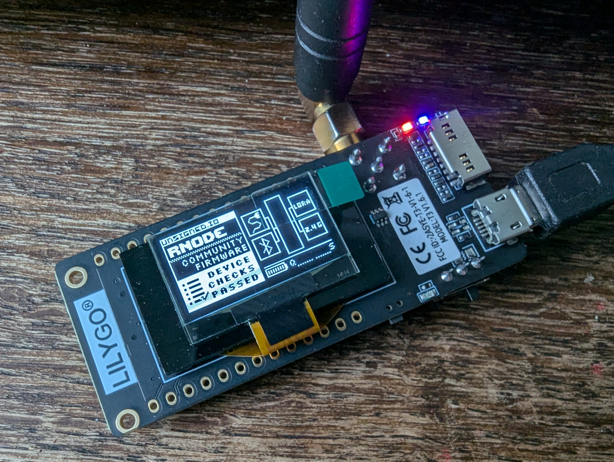
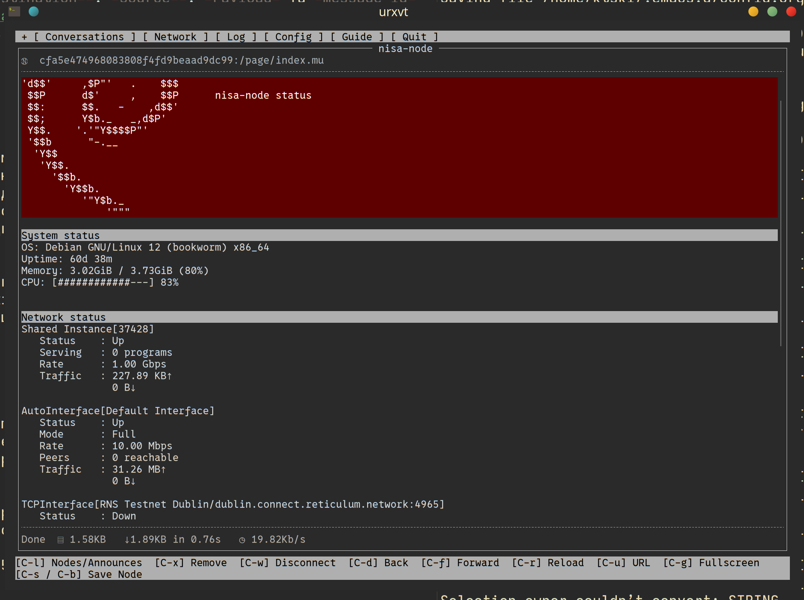
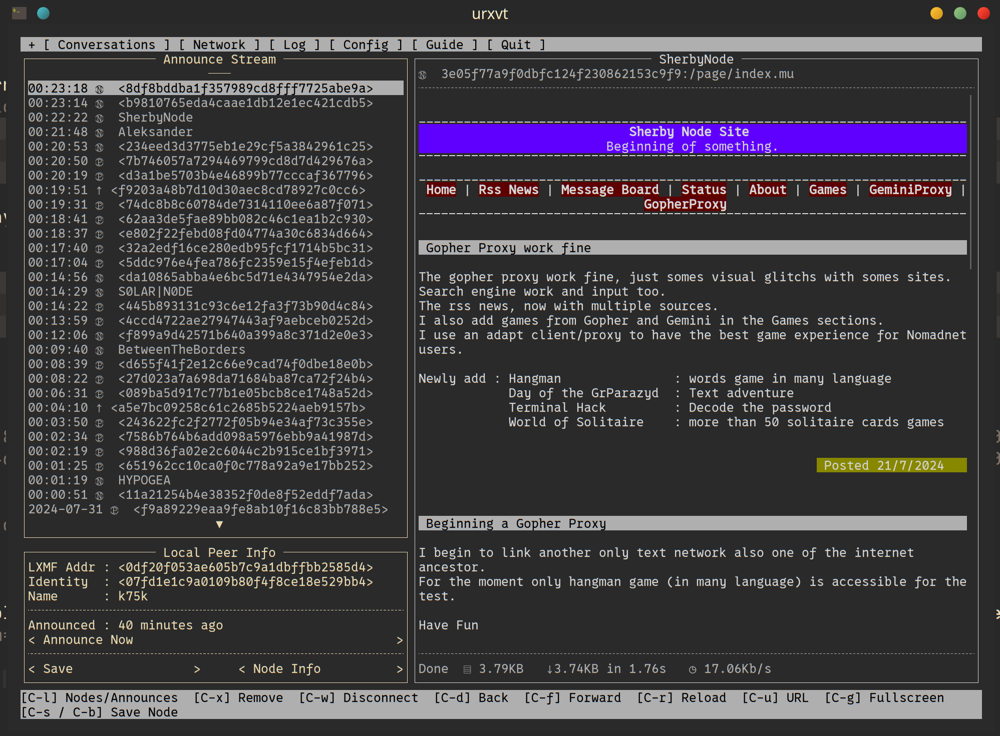
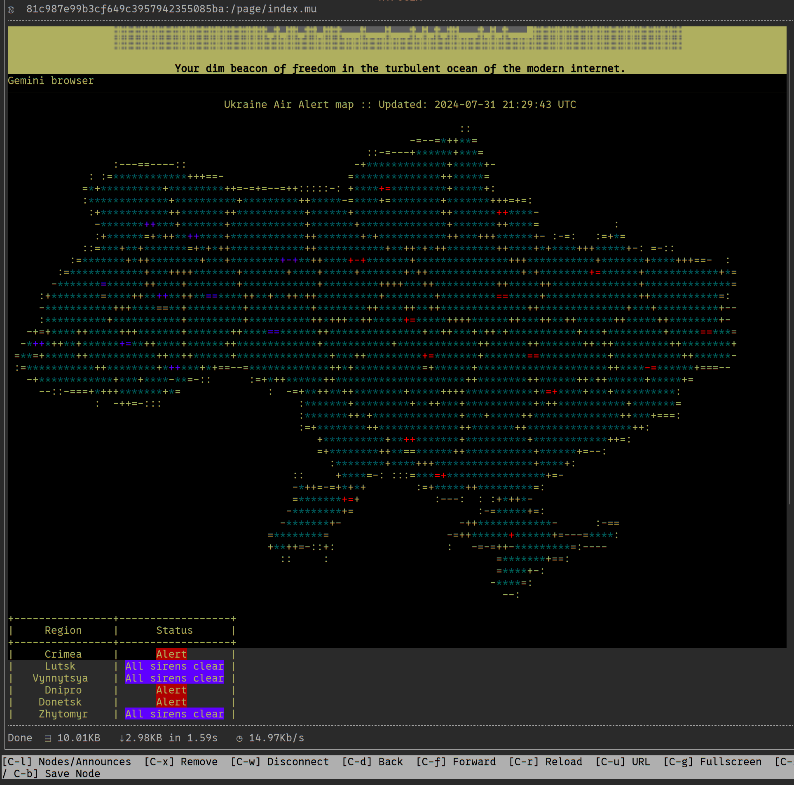
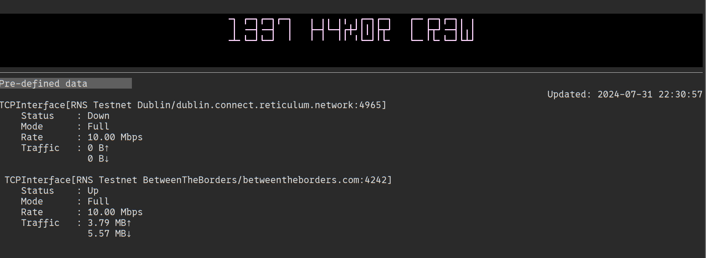

# Reticulum Network

Джерело матеріалу: [Персональний блог UT3USW](https://ut3usw.dead.guru/docs/ham/reticulum-network)

**Reticulum** - відкритий мережевий стек, заснований на криптографічних алгоритмах, для побудови локальних і глобальних мереж на доступному обладнанні. Reticulum може працювати навіть в умовах великої затримки та низьких пропускних здатностей. Так нам каже [офіційний сайт](http://reticulum.network/).


Отже, це набір інструментів для побудови приватних мереж. Ретікулюм якісно відрізняє кількість підтримуваних інтерфейсів, включаючи i2p та низку радіомодемів. В той час як VPN сервіси, на кшталт wireguard, потребують наявного підключення до інтернету - reticulum створений працювати по радіо на швидкості від 5біт/сек. Звісно така гнучкість має свою ціну - поріг входу в reticulum достатньо крутий, ком'юніті менше і велика кількість аспектів відверто сира та потребує від користувача навичок та розуміння. Розглянемо коротко протоколи, які роблять можливим це все. Якщо вас цікавить суто використання - сміливо пропускайте наступний розділ

**Автор:** UT3UMS

## Основи протоколу Reticulum

Замість концепції адрес та портів із стеку TCP/IP, ретікулюм використовує поняття `призначення` (destination). Він вираховується як SHA-256 хеш з деяких параметрів `призначення` та обрізається до 16 байт (128біт), наприклад `e28abb8404ff41936bff8ecee0ab3234`. `Призначення` існують чотирьох типів:

-   **Single:** пакети від одного відправника одному отримувачу. Шифруються ефемерними похідними ключами від ECDH. Такі повідомлення можуть читати лише автора та адресат
-   **Plain:** дешифровані повідомлення, призначені декільком отримувачам. Оскільки адресація мережі базується на шифруванні пакетів. Тому пакети з plain призначенням ніколи не транспортуються і доступні лише безпосереднім сусідам. Використовується для широкого мовлення публічної інформації, як ото маяки, публічна телеметрія, анонси, тощо.
-   **Group:** дані, що надсилаються на це `призначення` шифруються симетричним ключем. Тому вони доступні для читання всім, хто володіє цим ключем. На даний момент такі `призначення` теж не транспортуються, проте розробники плануються змінити це в майбутньому
-   **Link:** створює віртуальний канал типу `Single` через декілька стрибків. По суті VPN в рамках reticulum, але може працювати і без стрибків. З'єднання типу `Link` дає ширше апі, надійнішу доставку великих об'ємів данних, forward secrecy, initiator anonymity та багато іншого.

Окрім цього `призначення` можуть мати зручне ім'я `full name`, традиційно воно записується у точечному форматі, як домени в мережі інтернет. Проте ці імена не унікальні, різні ноди з однаковим іменем матимуть різний хеш та `призначення`.

В reticulum мережі не передбачено центрального ядра чи одного джерела істини. Для того щоб бути доступними, ноди періодично відправляють спеціальний пакет announce на всі доступні інтерфейси. Цей пакет містить:

-   Хеш призначення оголошувача
-   Публічний ключ оголошувача
-   Дані що залежать від конкретного застосування, так, ви можете додати, наприклад, поле статусу або опису своєї ноди
-   Випадковий бінарний блоб, що робить кожний новий анонс унікальним
-   Підпис Ed25519 на вищезазначену інформацію, що підтверджує автентичність

Детальніше про механізм анонсу можна почитати [тут](https://markqvist.github.io/Reticulum/manual/understanding.html#understanding-announce)

З використання асиметричного шифрування випливає наявність ідентичностей - `Identities`. Кожне призначення прив'язане до ідентичності, проте одна ідентичність може мати декілька адрес призначень. Ідентичність не обов'язково визначає людину чи акаунт, це абстракція сутності, яка може виконувати дії, або дії можуть бути виконані відносно неї.

Для більш стабільної роботи системи передбачено особливий два типи роботи нод - `reticulum instance` та `transport node`. До першої категорії відноситься переважна більшість всіх нод в мережі. Ноди транспортного типу схожі на floodfill роутери мережі i2p - вони допомагають адресації та, інколи, транспортуванню пакеті по мережі.

Ретікулюм підтримує велику кількість інтерфейсів:

-   **TCP:** клієнт та сервер
-   **UDP:** з можливістю broadcast
-   **I2P:** за умови запущеного роутеру, ретікулюм згенерує собі нову i2p адресу і в подальшому буде слухати вхдіний трафік на цій адресі
-   **Послідовний інтерфейс:** ретікулюм працюватиме по UART, що може бути корисно для специфічного обладнання, на кшталт IrDA.
-   **KISS:** ретікулюм може працювати з будь-якими радіомодемами та TNC що підтримуються протокол KISS.
-   **AX.25 KISS:** те саме, але кожен пакет ретікулюму додатково інкапсулюється у AX.25, корисно для великої кількості радіолюбительского пакетного обладнання та мереж
-   **PIPE:** ретікулюм відправлятиме всі пакети на stdin вказаної програми та очікуватиме в stdout вхідний трафік
-   **RNode:** спеціальний тип інтерфейсу для роботи через LoRa пристрої. Розробка пристроїв, які називаються RNode, підтримується спільнотою reticulum. Наразі існують як інструкції по DIY збірці, так і прошивки для популярних плат на базі esp32.
-   **Auto:** автоінтерфейс, використовує UDP, потребує мінімально комутованої мережі (достатньо ethernet свіча або wifi ap) та link-local IPv6. Не потребує IP інфраструктури, типу DHCP.

Досвідченим поціновувачам p2p та overlay мереж, ймовірно, reticulum нагадав дві класичні ініціативи - i2p та gnunet.


### Структура пакету

<table id="org6d46145" border="2" cellspacing="0" cellpadding="6" rules="groups" frame="hsides">


<colgroup>
<col  class="org-left" />

<col  class="org-left" />

<col  class="org-left" />

<col  class="org-left" />
</colgroup>
<tbody>
<tr>
<td class="org-left">HEADER 2 bytes</td>
<td class="org-left">ADDRESSES 16/32 bytes</td>
<td class="org-left">CONTEXT 1 byte</td>
<td class="org-left">DATA 0-465 bytes</td>
</tr>
</tbody>
</table>

-   [HEADER 2 байти]
    -   Байт 1: [Флаг IFAC], [Тип заголовка], [Тип передачі], [Тип призначення], [Тип пакету]
    -   Байт 2: Кількість хопів

-   [АДРЕСИ 16/32 байти]
    -   Кожна адреса: 16 байт
    -   Поле HEADER визначає, чи містить поле АДРЕСИ 1 або 2 адреси
    -   Адреси є хешами SHA-256, обрізаними до 16 байт

-   [КОНТЕКСТ 1 байт]
    -   Використовується Reticulum для визначення контексту пакета

-   [ДАНІ 0-465 байт]
    -   Містить корисне навантаження пакету

Детальніше дивіться в [офіційній документації](https://markqvist.github.io/Reticulum/manual/understanding.html#wire-format)


## RNS - Reticulum Network Stack

На даний момент, основна реалізація reticulum написана мовою python. Встановити його можна через pip або pipx останній самостійно створить віртуальне середовище під кожну установку і не зламає системі залежності пітона - `pip install rns` або `pipx install rns`. Звісно ви можете встановити його самостійно - [Releases · markqvist/Reticulum](https://github.com/markqvist/Reticulum/releases).

Набір утиліт чимось подібний до того, чим ми звикли користуватися в TCP/IP до Layer3.

-   **`rnsd`:** Головний службовий демон стеку. Має корисного ключа `rnsd --exampleconfig` для бутстрпаінгу конфігураційних файлів
-   **`rnstatus`:** Статистика по інтерфейсам, аналог `ip a` зі світу TCP/IP. Приймає фільтр імені інтерфейса в якості необов'язкового параметра: `rnstatus -A RNode`
-   **`rnid`:** Менеджмент ідентичностей і дотичний до цього криптографічний функціонал: розрахунок хешів призначень, шифрування/дешифрування файлів та повідомлень.
-   **`rnpath`:** Перевірка маршруту до заданого призначення, аналог `traceroute`. Приклад: `rnpath 81c987e99b3cf649c3957942355085ba`
-   **`rnprobe`:** Аналог утиліти `ping`, з тою відмінністю що призначення не відповідають на пробу, це конфігурується параметром `respond_to_probes` в основному конфізі. Якщо доступно, проба також відображає SNR та RSSI
-   **`rncp`:** Як зрозуміло з назви, це утиліта для передачі файлів між нодами. Для роботи, на приймаючій стороні `rncp` має бути запущений з ключем `--listen`
-   **`rnx`:** Віддалене виконання команд, можливе під'єднання в режимі псевдо-шеллу
-   **`rnodeconf`:** Утиліта для прошивки і налаштування LoRa-терміналів RNode. `rnodeconf --autoinstall` запустить конфігуратор і прошиє під'єднану плату у режимі майстра.


### Як цим користуватися?

Загалом, reticulum створений для побудови окремих приватних мереж. Втім, для того щоб спробувати і відчути ентузіасти підтримують так званий test net - публічна мережа RNS.  Щоб приєднатися до неї, необхідно створити [відповідні інтерфейси](https://reticulum.network/manual/gettingstartedfast.html#connect-to-the-public-testnet) в файлі `.reticulum/config`:
```ini
[interfaces]
...
# TCP/IP interface to the RNS Amsterdam Hub
[[RNS Testnet Amsterdam]]
  type = TCPClientInterface
  enabled = yes
  target_host = amsterdam.connect.reticulum.network
  target_port = 4965

# TCP/IP interface to the BetweenTheBorders Hub (community-provided)
[[RNS Testnet BetweenTheBorders]]
  type = TCPClientInterface
  enabled = yes
  target_host = betweentheborders.com
  target_port = 4242

# Interface to Testnet I2P Hub
[[RNS Testnet I2P Hub]]
  type = I2PInterface
  enabled = yes
  peers = g3br23bvx3lq5uddcsjii74xgmn6y5q325ovrkq2zw2wbzbqgbuq.b32.i2p
```
Детальніше про налаштування інших інтерфейсів можна [прочитати тут](https://reticulum.network/manual/interfaces.html)

Запустіть `rnsd` в консолі і ви побачите
```md
[2024-08-03 00:00:04] [Debug] Started shared instance interface: Shared Instance[37428]
[2024-08-03 00:00:04] [Verbose] Bringing up system interfaces...
[2024-08-03 00:00:05] [Debug] Establishing TCP connection for TCPInterface[RNS Testnet Dublin/dublin.connect.reticulum.network:4965]...
[2024-08-03 00:00:05] [Info] Bringing up I2P tunnel to I2PInterfacePeer[RNS Testnet I2P Hub A to g3br23bvx3lq5uddcsjii74xgmn6y5q325ovrkq2zw2wbzbqgbuq.b32.i2p], this may take a while...
[2024-08-03 00:00:10] [Error] Initial connection for TCPInterface[RNS Testnet Dublin/dublin.connect.reticulum.network:4965] could not be established: timed out
[2024-08-03 00:00:10] [Error] Leaving unconnected and retrying connection in 5 seconds.
[2024-08-03 00:00:10] [Debug] Establishing TCP connection for TCPInterface[RNS Testnet BetweenTheBorders/betweentheborders.com:4242]...
[2024-08-03 00:00:10] [Debug] TCP connection for TCPInterface[RNS Testnet BetweenTheBorders/betweentheborders.com:4242] established
...
```
#### rnsd як системна служба

    Щоб все було солідно, сервіс мережевого стеку має працювати як демон, в фоні. Створимо systemd-юніт `/etc/systemd/system/rnsd.service`, щоб `rns` став звичайною системною службою
```ini
# /etc/systemd/system/rnsd.service
[Unit]
Description=Reticulum Network Stack Daemon
After=multi-user.target

[Service]
# If you run Reticulum on WiFi devices,
# or other devices that need some extra
# time to initialise, you might want to
# add a short delay before Reticulum is
# started by systemd:
# ExecStartPre=/bin/sleep 10
Type=simple
Restart=always
RestartSec=3
User=%username%
ExecStart=rnsd --service

[Install]
WantedBy=multi-user.target
```
    Якщо ви встановлювали `rns` через `pipx`, потрібно переконатися, що файл виконуваний файл `rnsd` доступний в системному `$PATH`. Найпростіше створити сім-лінку, наприклад, в `/usr/local/bin/`:
```bash
# Перевіримо чи немає программи з таким іменем
ls -l /usr/local/bin/rnsd
# Вихлоп має бути порожнім

# Пересвідчимось, куди pipx складає файли:
pipx list | grep -i '$PATH'
# Вихлоп має бути приблизно
# apps are exposed on your $PATH at /home/%username%/.local/bin
# якщо директорія відрізняється - використовуйте в наступній команді ваше значення

# Створимо сім-лінку в /usr/local/bin, що посилатиметься на версію, встановлену pipx
sudo ln -s /home/%username%/.local/bin/rnsd /usr/local/bin/rnsd

# Завантажимо наш новий юніт в Systmed
sudo systemctl --user daemon-reload
sudo systemctl enable rnsd.service
sudo systemctl start rnsd.service
sudo systemctl status rnsd.service
# Помилок не має бути

rnstatus
# Покаже статистику по інтерфейсам
```
### RNode інтерфейс

    Можливість власного зашифрованого, завадостійкого і при тому дешевого фізичного рівня - те що цікавить в reticulum чи не в першу чергу. Все що потрібно - esp32 мікропроцессор та один з LoRa чіпів на інтерфейсі SPI. Підтримуються популярні девборди, такі як: `LilyGO LoRa32 v2` `Heltec LoRa32 v2` [повний список](https://github.com/liberatedsystems/RNode_Firmware_CE/tree/master). Я неодноразово прошивав LilyGO LoRa32 та LilyGO T-BEAM.

    Важливо розуміти відмінність від Meshtastic - RNods це виключно радіоінтерфейс. Без комп'ютера або телефона, що активно під'єднаний до RNode, мережа не працюватиме. Це як 3g-модем, що вставлений в USB зарядку.

    Щоб створити RNode на базі девборди, під'єднайте її в режимі прошивки і запустіть `rnodeconf --autoinstall`. Текстовий помічний спитає модель вашої борди, LoRa модуля, підбере файл прошивки і завантажить його на девайс.

    

    Тепер необхідно сконфігурувати інтерфейс, задавши для RNode всі параметри фізичного рівня.

:::danger ВАЖЛИВО!
    Ви збираєтесь використовувати саморобний цифровий радіо-трансмітер, будь-ласка зауважте локальне законодавство. Пам'ятайте, порушення плану використання радіочастот може нести не тільки юридичні наслідки. Ненавмисне створення завад в ефірі може вплинути на техніку, від якої залежить життя людей. Ви маєте усвідомлювати що ви робите і ви несете повну відповідальність за свої дії
:::

```ini
[interfaces]
...
  [[RNode LoRa32-RNode]]
    type = RNodeInterface
    interface_enabled = True
    port = /dev/ttyACM0
    frequency = 653000000 # частота в герцах 635MHz
    bandwidth = 125000    # ширина каналу в герцах 125 KHz
    txpower = 7           # потужність передавача dBm (5 mW)
    spreadingfactor = 8   # Кількість чірпів на символ, значення 7-12
    codingrate = 5        # Розмір службових бітів пакету значення 5-8
  ...
```
    Перевірити статус інтерфейсу можна за допомогою команди `rnstatus LoRa32-RNode`, ви маєте побачити щось подібне:
```bash
RNodeInterface[RNode LoRa32-RNode]
    Status    : Up
    Mode      : Full
    Rate      : 3.12 kbps
    Airtime   : 1.3% (15s), 0.01% (1h)
    Ch.Load   : 1.3% (15s), 0.01% (1h)
    Traffic   : 102 B↑
                0 B↓
```
    Відомості про RNode доступні в `rnodeconf -i /dev/ttyACM0`.
```md
[00:43:25] Device info:
[00:43:25]      Product            : LilyGO LoRa32 v2.1 420 - 520 MHz (%MAC%)
[00:43:25]      Device signature   : Unverified
[00:43:25]      Firmware version   : 1.72
[00:43:25]      Hardware revision  : 1
[00:43:25]      Serial number      : 00:00:00:01
[00:43:25]      Modem chip         : SX1278
[00:43:25]      Frequency range    : 420.0 MHz - 520.0 MHz
[00:43:25]      Max TX power       : 17 dBm
[00:43:25]      Manufactured       : 2023-12-14 20:22:23
[00:43:25]      Device mode        : Normal (host-controlled)
```
Якщо Bluetooth вимкнено, RNode підніме точку доступу WiFi та невеликим HTTP сервером. Він роздає документаію та дистрибутив RNS, LXMF та Nomadnetwork. А також на сервері доступна прошивка RNode, rnodeconf та моделі корпусу під 3д-друк - все це за адресою `<http://10.0.0.1/>`. Тобто RNode несе на собі все, що необхідно для подальшого розгортання мережі і створення нових RNode.


## LXMF

Reticulum це мережевий стек, а не мережа. Він вирішує задачі транспорту, адресації та супутньої криптографії. Звісно, він має ряд суттєвих обмежень, наприклад на довжину пакета. Тому, щоб ми не сумували, автор Reticulum - Mark Qvist одразу створив протокол верхнього рівня LXMF. В офіційній документації він описується як протокол повідомлень та доставки (messaging and delivery), що цілко відповідає мінімалістично-ефективному духу мережі. Протокол створений за замовчуванням реалізовувати сервіси доставки повідомлень. SMS/email/IM/FIDO-подібні сервіси реалізуються на LXMF з нульовим оверхіпом. Саме тому "пакети" LXMF прийнято називати повідомленнями - `message`. Клієнт-серверна термінологія не завжди є доречною в світі lxmf, найкращі аналогії це USENET або MTA.

lxmf-router це окрема утиліта, яка так само доступна в pip, pipx - `pip install lxmf` або `pipx install lxmf` -та у вигляді [сорців](https://github.com/markqvist/LXMF/releases). Скоріше за все, цей пакет буде в залежностях високорівневого reticulum-софта, яким ви будете користуватися.


### Структура повідомлення LXMF

Кожне повідомлення ідентифікується за `message-id` - SHA-256 хешем полів `Destination=`, `Source=` та `Payload`. Оскільки цей хеш може бути визначений в будь-який момент, повідомлення LXMF не містять його в собі окремим полем.

-   **`Destination`:** 16-байний хеш призначення reticulum
-   **`Source`:** 16-байтний хеш призначення reticulum
-   **`Ed25519 Підпис`:** 64-байтний хеш `Destination=`, `Source=`, `Payload` та `message-id`
-   **`Payload`:** серіалізується у [MessagePack](https://msgpack.org/) формат та містить наступні поля:
    -   **`Timestamp`:** double-precision float час `UNIX epoch`
    -   **`Content`:** тіло повідомлення.
    -   **`Title`:** заголовок повідомлення
    -   **`Fields`:** словник довільної глибини та структури

Поля `Content`, `Title`, `Fields` є обов'язковими, але можуть бути порожніми.

Окремі LXMF ноди можуть працювати в режимі Propagation. При цьому вони будуть накопичувати повідомлення для учасників, які перебувають оффлайн, реалізуючи механізм store and forward. Коли повідомлення зберігається для користувачів поза мережею, в такому випадку реальний `message-id` від `Payload` не може бути порахованим, бо `Payload` зашифрований для кінцевого призначення. В таких випадках повідомленням присвоюється тимчасовий `transient-id`.

Оскільки LXMF повідомлення за своєю структурою це хеш, воно може бути роздруковано у виглді QR коду або URL з префіксом, скажімо `lxm://`. Мінімалістичний дух доставки повідомлень будь-яким чином резонує з іншим проектом - [nncp](http://www.nncpgo.org/), але nncp не функціонує в глобальному масштабі.

LXMF відчувається як аналог HTTP в світі reticulum. Вже існує деяка кількість софту, що працює на LXMF і навіть взаємодіє одне з одним.


### Nomadnet

Софт авторства все того ж Mark Qvist. Nomadnet можна описати як гнучкий гібрид bbs та p2p gopher мереж. Поки що існує лише TUI клієнт, написаний на пітоні. `pip install nomadnet` або `pipx install nomadnet` та [релізи](https://github.com/markqvist/NomadNet/releases). При встановленні через pipx вам знадобиться також поставити `lxmf` та `rns`.

Для запуску в режимі клієнта достатньо просто виконати `nomadnet` і перед вами відкриється вражаюче, як на мене, текстове меню в дусі FAR, minicom, tmux та іншої класики TUI.



Вкладка `[ Conversations ]` це месcенджер, що працює на чистому LXMF, це робить `nomadnet` сумісним з інишими програмами як мінімум в контексті листування між користувачами
Вкладка `[ Network ]` це переглядач nomadnet вузлів - по відчуттях це аналог BBS та ZX-net. Сторінки верстаються мовою розмітки Micron, повний її опис з прикладами доступний у вкладці `[ Guide ]`.



Комбінація клавіш `Ctrl+G` ховає або показує бічну панель. В ній відображаються анонси, отримані від нод. Символом "Ⓟ" позначається звичайна нода, символом "↑" - нода в режимі propagation. Ви можете зберігти ноду у певний аналог "вибраного" - тоді замість хешу буде відображатися її ім'я - наприклад "S0LAR|N0DE".



`nomadnet://81c987e99b3cf649c3957942355085ba:/page/index.mu`


### Розміщення своєї сторінки

Для того щоб створити свою сторінку в мережі nomadnet і зробити її доступною, вам знадобиться:

#### Сконфігурувати ноду

    `nomadnet` це p2p софт, проте за замовчуванням він працює в режимі клієнта. Щоб стати "хостером" необхідно активувати режим ноди
```ini
[node]
enable_node = yes
node_name = HYPOGEA
announce_interval = 360
announce_at_start = Yes
# pages_path = ~/.nomadnetwork/storage/pages
```
#### Запустити службу `nomadnet`

    Для того щоб працювати в фоні, як це роблять веб севера, `nomadnet` має бути запущеним як демон. Я використовую наступний `systemd.unit` для автоматичного запуску ноди:
```ini
[Unit]
Description=Nomadnet Daemon
After=multi-user.target

[Service]
Type=simple
Restart=always
RestartSec=3
User=%username%
ExecStart=nomadnet -d

[Install]
WantedBy=multi-user.target
```
#### Створити сторінку

    Сторінка може бути як чистим micron файлом, так і пітон-скриптом що повертає такий файл. Розширення файлу `.mu`.
```python
#!/usr/bin/env python3

import os
import time
import subprocess

# Browser pages cache time in seconds.
CACHE_TIME = 0 #0=No cache, None=Default
# Date/time format for formatting on the screen.
DATE_TIME_FORMAT = "%Y-%m-%d %H:%M:%S"

# Screen template - Main
TEMPLATE_MAIN = """
`B200`FECF`c
╺┓ ┏━┓┏━┓┏━┓   ╻ ╻╻ ╻╻ ╻┏━┓┏━┓   ┏━╸┏━┓┏━┓╻ ╻
    ┃ ╺━┫╺━┫  ┃   ┣━┫┗━┫┏╋┛┃┃┃┣┳┛   ┃  ┣┳┛╺━┫┃╻┃
╺┻╸┗━┛┗━┛  ╹   ╹ ╹  ╹╹ ╹┗━┛╹┗╸   ┗━╸╹┗╸┗━┛┗┻┛

`!`F222Cyberpunx or syberskunx?.
``
-
`B444`<user_input`Pre-defined data>`b
`rUpdated: {date_time}
{entrys}

"""

# Встановлення TTL кешу для сторінки через директиви мови micron
if CACHE_TIME != None:
    print("#!c="+str(CACHE_TIME))

tpl = TEMPLATE_MAIN
tpl = tpl.replace("{date_time}", time.strftime(DATE_TIME_FORMAT, time.localtime(time.time())))
tpl = tpl.replace("{entrys}", subprocess.getoutput("rnstatus testnet").strip())
print(tpl)
```
    Розмітка починається з символу `` ` ``, далі іде, наприклад `B` - background та три шістнадцяткові цифри. Micron використовує трисимвольну шістнацяткову палітру кольорів. Щоб не рахувати вручну, ось [всі 4096 можливих кольорів у таблицях](https://borderleft.com/toolbox/hex/). `` `r=/ =`l=/ =`c `` - вирівняти елемент по правому краю/лівомукраю/центру. Детальніше дивіться у `[ Guide ]` та в [прикладах](https://github.com/markqvist/NomadNet/tree/master/nomadnet/examples), що ідуть разом з кодом.

    


### Sideband

Мобільний застосунок, близький до `Meshtastic` за функціоналом. UX налаштувань інколи буває неочевидним. Наприклад:

-   для конфігурації RNode, ви маєте створити пару через системний менеджер Bluetooth, додати ім'я Bluetooth пристрою RNode у відповідне місце в налаштуваннях Sideband і перезапустити застосунок
-   всі кнопки, що пов'язані з імпортом, очікують на данні у буфері обміну.

Застосунок постійно розвивається


## Посилання

-   **[Getting Started Fast - Reticulum Network Stack 0.7.6 beta documentation](https://markqvist.github.io/Reticulum/manual/gettingstartedfast.html):** чудова документація from zero to hero якщо ви вже розумієте основи мережі
-   [SebastianObi/LXMF-Tools: Various small programs and tools which use the message protocol LXMF](https://github.com/SebastianObi/LXMF-Tools)

Джерело матеріалу: [Персональний блог UT3USW](https://ut3usw.dead.guru/docs/ham/reticulum-network)
