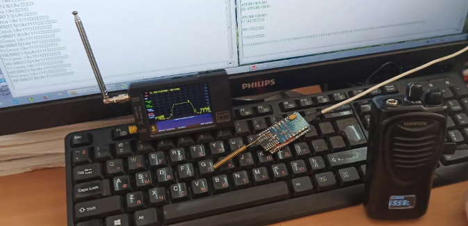

# Крос-бенд Lora мереж та REPEATER (папуга)

# Крос-бенд Lora мереж та REPEATER (папуга)

Наразі проект **Meshtastic** не має підтримки двох SPI (або UART) модулів Lora для організації ретранслятора (шлюзу) даних між мережами різних діапазонів. Однак альтернативні MESH-проекти таку можливість мають із коробки. В режимі **CrossBand** здійснюється двостороння Half-Duplex ретрансляція "будь-яких" даних до 250 байт на пакет між двома Lora-мережами на "будь-якій" частоті як у прозорому режимі, так і в AES256 через основний та додатковий Lora-модулі з дешифруванням з боку інших терміналів.

Під "будь-якими" даними і частотою маються на увазі ТТХ можливості конкретних трансіверів Lora і обмежень фізичного каналу зв'язку. Слід розуміти, що смуга каналу та розширення спектра є визначальними у швидкості обміну даними. Тому для виключення пропусків таймінг між пакетами у більш швидкісній мережі повинен бути більше часу передачі у менш швидкісній (з більшим SF та/або меншим BW).

    <iframe
        width="100%"
        height="100%"
        src="https://www.youtube.com/embed/TEi8OtjNWmY"
        frameborder="0"
        allow="autoplay; encrypted-media"
        allowfullscreen>
    </iframe>

## Алгоритм CrossBand

1. При прийманні будь-якого пакету даних, наприклад **EU_433 (Meshtastic)** на частоті 433.575 MHz, пакет без змін ретранслюється на заданий пресет користувача (наприклад, 868 MHz).
2. При прийманні будь-якого пакету на заданому пресеті користувача, пакет без змін ретранслюється на частоті 433.575 MHz каналу **EU_433 (Meshtastic)**.

## Можливості

1. Об'єднання радіомереж Lora і **MESH on Lora** (Meshtastic, etc...) як на місцевому рівні, так і через супутникові канали зв'язку, що працюють на різних частотах (наприклад, 433 та 868 МHz або навіть 2.4 GHz) та різними смугами BW, розширенням спектра SF. Тобто можливо створення мостів між супутниковими каналами та навіть каналами різних супутників.

2. Підвищення радіосхованості під час роботи у прямому каналі.
Режим **REPEATER** основного та/або вторинного радіомодуля Lora розширює радіус покриття радіомережі або виконує роль папуги. В цьому режимі здійснюється прийом та перевипромінювання прийнятого пакета на частотах та з параметрами заданих індивідуально основному та вторинному радіомодулю Lora.

3. Режим **CrossBand** та **REPEATER** можуть працювати як спільно, так і окремо в Half-Duplex.

4. Підтримка лінійки трансиверів **SX126x** (SX1261, SX1262, SX1268, LLCC68), **SX127x** (SX1272, SX1273, SX1276, SX1277, SX1278, SX1279), **SX128x** (SX1280, SX1281, SX1282) з конфігуруванням основного та додаткового радіомодулів в режим Lora або FSK.

5. Для підключення другого Lora-модуля серій **SX126x**, **SX127x** або **SX128x** використовується загальна SPI шина. При цьому сигнали керування потребують окремих GPIO.

## Режим REPEATER

Даний режим можливо активувати незалежно для основного та вторинного радіомодулів для роботи в прямому каналі або рознесених частотах. На додачу до ретрансляції текстових повідомлень може ретранслювати також голосові повідомлення між двома віддаленими кореспондентами, які не чують один одного, так й організовувати ланцюжок з кількох таких ретрансляторів для більшого покриття "складної" території, тобто одноранговий голосовий MESH, в наступних режимах:

1. Відкритий
2. Шифрування статичним паролем **AES256**
3. Шифрування динамічним паролем **AES256** при наявності GPS модуля

