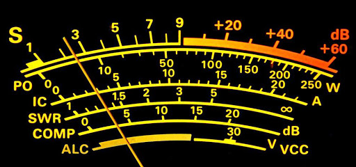

# Практичні звіти про сигнали

Джерело матеріалу: [Персональний блог UT3USW](https://ut3usw.dead.guru/docs/ham/practical-signal-reports)

Кожен хоче знати, як звучить його сигнал в ефірі, найкращим способом дізнатися є звіт про сигнал від інших радіоаматорів. Стандартним методом звітування про сигнал для аматорського радіо є система RST (Readability-Signal Strength-Tone), максимальною (найкращою) оцінкою для SSB є RS = 59, а для CW - RST = 599.

На КВ-діапазонах ви зазвичай почуєте щось на кшталт цього: «чую вас на п’ять дев’ять у цекнтральному Криму».

Потужність сигналу зазвичай відображає те, що оператор бачить на S-метрі свого приймача. Звичайно, як CW, так і SSB, S-метр буде трохи "стрибати", тому потрібна деяка інтерпретація значень. Що ще важливіше, існують багато варіацій калібрування S-метра, тому звіти про сигнали можуть відрізнятися залежно від радіо.

Звіт 55 або 57 вказує на те, що сигнал добре читається, але сила сигналу не така сильна, як у сигналу з 59 .

Більшість S-метрів показують розширену шкалу вище S9, яка вказана в децибелах. Шкала може бути позначена +10 дБ, +40 дБ тощо, що вказує на те, що потужність сигналу набагато сильніша, ніж S9. У цьому випадку ви почуєте, як радіоаматори говорять щось на кшталт «ви 5 9 плюс 20 дБ».

Оператори CW можуть замінити 9 на літеру N, надсилаючи звіт 5NN. (В азбуці Морзе N є набагато коротшим символом, ніж 9.)

599: `..... ----. ----.` та 5NN: `..... -. -.` - це одне й те ж.
Насправді існує набір «урізаних чисел», які CW оператори часто використовують для скорочення: 0 замінюється на T, 5 замінюється на E тощо. Звіт RST 599 можна надіслати як ENN.

На УКХ FM звіти про сигнали часто подаються в термінах заглушення FM. Кажуть, що сильний FM-сигнал «заспокоює приймач», оскільки в отриманому аудіо, шуму практично немає. По мірі зниження потужності сигналу в отриманому сигналі починають з’являтися шуми. При певному рівні сигналу, шум різко зростає і сигнал стає поганим. Це різке збільшення називається пороговим ефектом *threshold effect*, тобто FM-сигнали не загасають поступово, вони раптово "врізаються" в шум. Ключова ідея тут полягає в тому, що ви хочете, щоб ваш сигнал був достатньо сильним, щоб перевищувати поріг шуму. З точки зору звіту про сигнал, сильний сигнал може призвести до звіту про «повне затихання». Якщо сигнал менше, ніж повне затихання, ви можете почути повідомлення на кшталт «90 відсотків затихання» або «у вас близько 10% шуму», обидва описують кількість шуму в сигналі. Якщо сигнал дійсно шумний, у звіті може бути «50% тиші».

Ви також почуєте класичний звіт про сигнал 5 9 на FM, де мається на увазі «відмінний сигнал». У той час як S-метри CW/SSB трансиверах часто погані на FM модуляціях.

Іноді оператор на іншому кінці шукає більш точної і критичної оцінки якості свого сигналу. Якщо він скаже щось про те, що «перевіряю новий мікрофон» або «працюю над вирішенням проблеми зі звуком», це може бути підказкою витратити трохи додаткового часу на справжнє прослуховування сигналу та надання додаткових коментарів щодо його звучання. Для більшості з нас ми фактично не можемо почути власний сигнал в ефірі, тому дуже корисно отримати якісний зворотний зв’язок від інших радіоаматорів.

Система RST, як зазначено на веб-сайті ARRL (http://www.arrl.org/quick-reference-operating-aids):

## Розбірливість (Readability)

1. Нерозбірливо, прийом неможливий.
2. Можна розібрати окремі слова, букви.
3. Розбірливо, але з великими труднощами (30-50%).
4. Розбірливо практично без труднощів.
5. Абсолютно розбірливо (100%).

## Сила сигналу (Signal Strength)
1. Слабкі сигнали, ледь помітні.
2. Дуже слабкі сигнали, прийом майже неможливий.
3. Слабкі сигнали, що приймаються насилу
4. Тихі сигнали
5. Задовільні сигнали.
6. Хороші сигнали.
7. Помірно сильні сигнали.
8. Сильні сигнали.
9. Надзвичайно сильні сигнали.

## Тон (Tone)
1. надзвичайно грубий, шиплячий тон
2. дуже грубий тон
3. хрипкий, злегка музичний тон
4. досить хрипкий тон середньої музичності
5. дзюркотливий музично-модульований тон
6. Відфільтрований тон, чіткий слід пульсацій модуляції.
7. Майже чистий тон, невеликими слідами пульсації модуляції.
8. Майже ідеальний тон, легкі сліди модуляції.
9. Ідеальний тон, жодних слідів пульсації чи будь-якої модуляції.

Джерело матеріалу: [Персональний блог UT3USW](https://ut3usw.dead.guru/docs/ham/practical-signal-reports)
