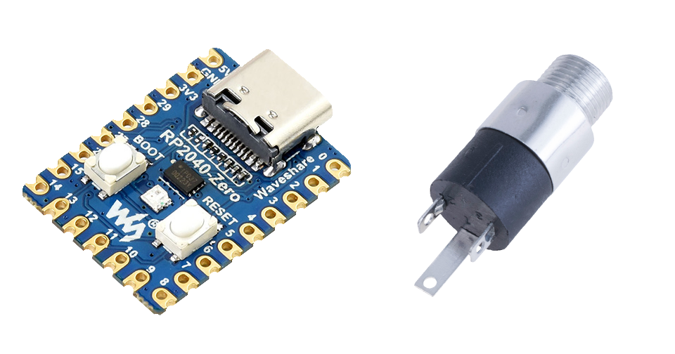
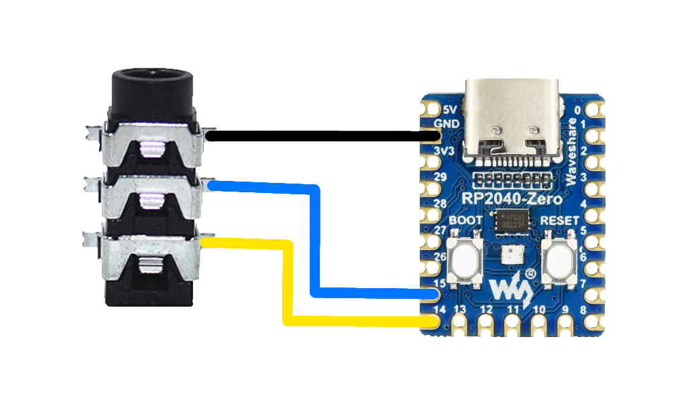
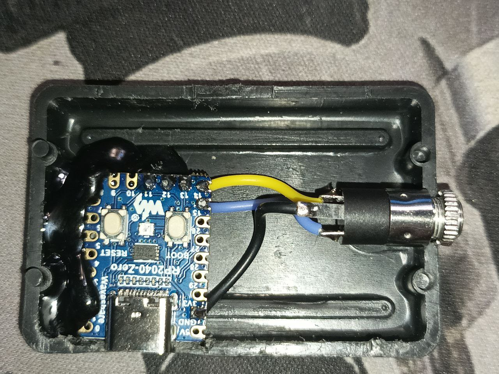
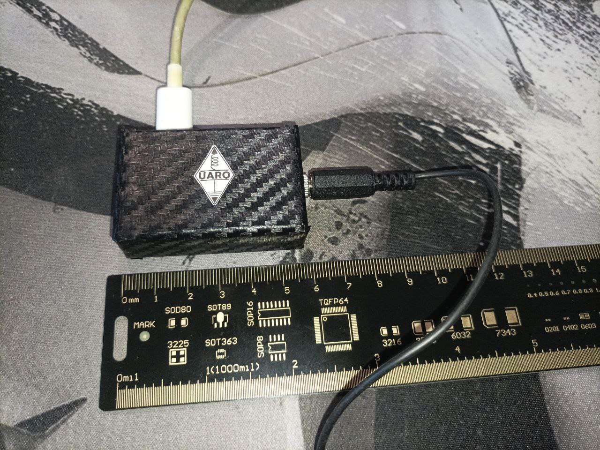
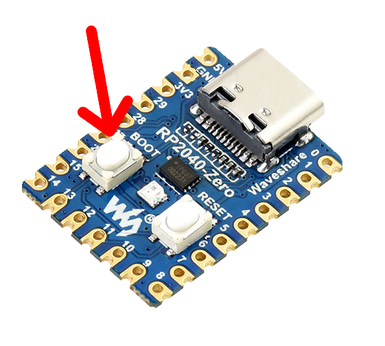

В даній статі поглянемо на один з проєктів [UARO](https://uaro.org.ua/) - спеціальний перехідник для ямбічних Морзе ключів, який дозволить їх підключати до різного роду Морзе тренажерів на телефоні та ПК!

___

## Компоненти

В основі даного перехідника лежить мікроконтролер RP2040, а якщо конкретніше - двеборди Raspberry Pi Pico. Найкраще всього себе зарекомендували девборди **RP2040-Zero** від Waveshare, через свій доволі маленький розмір. Окрім мікроконтролера також знадобиться **гніздо під штекер 3.5мм**, так як більшість ямбічних ключів мають саме такий спосіб підключення.

Приклад компонентів в магазині  rcscomponents:

- [RP2040-Zero](https://www.rcscomponents.kiev.ua/product/rp2040-zero_186292.html)
- [Гніздо 3.5мм](https://www.rcscomponents.kiev.ua/product/hnizdo-jack-3-5mm-stereo-pj-392_198525.html)



___

## Схема

Підключити все доволі просто: на перший контакт 3.5мм гнізда йде земля з мікроконтролера - GND. А другий та третій підключаються до GPIO 14 та GPIO 15. Більше нічого підключати не треба.






___

## Прошивка мікроконтролера



Для того щоб прошити мікроконтролер, необхідно затиснути кнопку BOOT на платі мікроконтролера, та підключити його до комп'ютера. Комп'ютер побачить мікроконтролер як звичайну флешку, з назвою на кшталт **RPI-RP2**, та приблизно ось таким змістом всередині:

 

В такому режимі мікроконтролер очікує прошивку в форматі `.uf2`. Проєкт базується на прошивці **CircuitPython**, щоб користувачі могли легко його налаштовувати, без потреби в перекомпіляції прошивки. Необхідно завантажити [відповідний .uf2 файл](https://downloads.circuitpython.org/bin/waveshare_rp2040_zero/en_US/adafruit-circuitpython-waveshare_rp2040_zero-en_US-9.2.9.uf2), та копіювати його на мікроконтролер.

Після цього мікроконтролер перезавантажиться, і буде знову доступний як звичайна флешка, але на цей раз з назвою **CIRCUITPY**, та ось таким змістом:

 

Спочатку треба в директорію lib (створіть якщо не існує) помістити бібліотеку **adafruit_hid** - просто створити директорію **adafruit_hid** з [наступним змістом](https://github.com/adafruit/Adafruit_CircuitPython_HID/tree/main/adafruit_hid).

Далі необхідно відкрити та редагувати файл `code.py`. Видаліть попередній зміст, та копіюйте туди наступний код:

```python
import time
import board
import digitalio
import usb_hid
from adafruit_hid.keyboard import Keyboard
from adafruit_hid.keycode import Keycode

kbd = Keyboard(usb_hid.devices)

button_s = digitalio.DigitalInOut(board.GP14)
button_s.direction = digitalio.Direction.INPUT
button_s.pull = digitalio.Pull.UP

button_a = digitalio.DigitalInOut(board.GP15)
button_a.direction = digitalio.Direction.INPUT
button_a.pull = digitalio.Pull.UP

prev_s = True
prev_a = True

while True:
    curr_s = button_s.value
    curr_a = button_a.value

    # Налаштування кнопок. Наприклад якщо потрібна кнопка Q замість S: міняємо обидва Keycode.S на Keycode.Q

    if not curr_s and prev_s:
        kbd.press(Keycode.S)
    elif curr_s and not prev_s:
        kbd.release(Keycode.S)

    if not curr_a and prev_a:
        kbd.press(Keycode.A)
    elif curr_a and not prev_a:
        kbd.release(Keycode.A)

    prev_s = curr_s
    prev_a = curr_a

    time.sleep(0.01)
```

В цілому, перехідник вже готовий до використання. Але пристрої до яких він буде підключений (комп'ютер, телефон) будуть продовжувати бачити його як флеш накопичувач. Щоб цього позбутись, треба в корені флеш накопичувача мікроконтролера (там де знаходиться `code.py`) створити ще один файл - `boot.py` з наступним вмістом:

```python
import board
import digitalio
import storage
import time

button = digitalio.DigitalInOut(board.GP14)
button.switch_to_input(pull=digitalio.Pull.UP)
time.sleep(0.1)

if not button.value:
    storage.enable_usb_drive()
else:
    storage.disable_usb_drive()
```

Таким чином, мікроконтролер в подальшому не буде підключатись як флеш накопичувач. А якщо треба модифікувати налаштування, то можна затиснути одну зі сторін ямбічного ключа при підключенні (та, яка була припаяна до GPIO 14), і тоді мікроконтролер знову підключиться як флеш накопичувач, що дасть змогу модифікувати код.

В додатках нижче можна завантажити архів, в якому я зібрав всі необхідні файли, які треба помістити в корінь флеш накопичувача після прошивки CircuitPython. Тобто просто копіюєте все з архіву в корінь флеш накопичувача, погоджуючись на заміну файлів, і пристрій буде готовий до роботи.

___

## Використання

Для того щоб користуватись перехідником, достатньо просто підключити його за допомогою Type-C кабелю до необхідного пристрою. Пристрій побачить перехідник як звичайну клавіатуру, і буде імітувати натискання клавіш `A` та `S` в залежності від натискання ключа. Клавіші `A` та `S` можна замінити на будь які необхідні в файлі `code.py` - після прошивки перед підключенням перехідника затисніть одну зі сторін ключа (ту, яка була підключена до GPIO 14, тобто ту яка імітує клавішу `S`), і перехідник підключиться як флеш накопичувач. Далі відкрийте `code.py`, та відредагуйте строки коду з `kbd.press`.


___

## Додатки

- [CircuitPython.uf2](https://downloads.circuitpython.org/bin/waveshare_rp2040_zero/en_US/adafruit-circuitpython-waveshare_rp2040_zero-en_US-9.2.9.uf2)
- [Архів проєкту](/files/rpi.zip)
