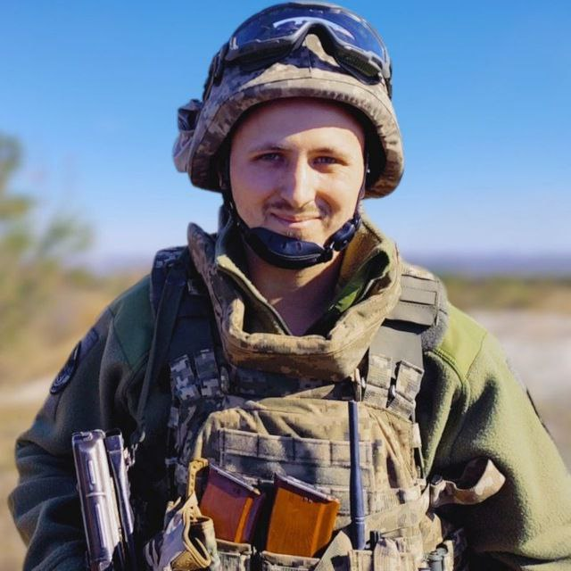
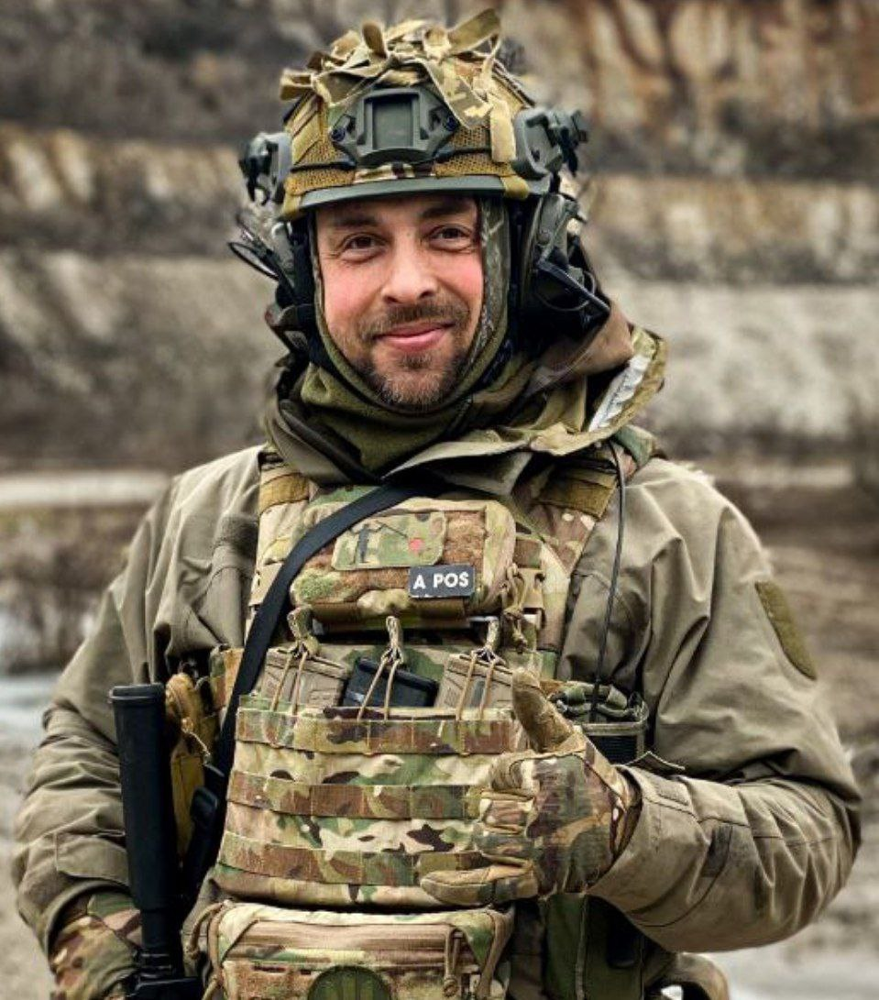

# Про нас

Спільнота "Оператори аматорських радіостанцій України" була заснована у 2024 році двома радіоаматорами, військовими 
зв’язківцями та ветеранами війни – Леонідом Павлюченком (UT3UTX) і Віталієм Лазебником (UT3UUK).

UARO розпочав свій шлях як локальний колектив користувачів київських радіоаматорських ретрансляторів R3, R81 і К2. 
Протягом 2024 року воно зростало у геометричній прогресії, а географія учасників вийшла за межі України.

На початку 2025 року ми отримали офіційний статус громадської організації. ГО "UARO" ставить перед собою амбітну мету – 
стати локомотивом популяризації аматорського радіозв’язку серед молоді, займатися науково-просвітницькою діяльністю, 
писати та публікувати наукові матеріали з тематики радіозв’язку, а також підтримувати армію шляхом навчання фахівців зі зв’язку.

:::info[Голова організації]
Леонід Павлюченко (UT3UTX)
:::

:::info[Заступник голови організації]
Віталій Лазебник (UT3UUK)
:::
