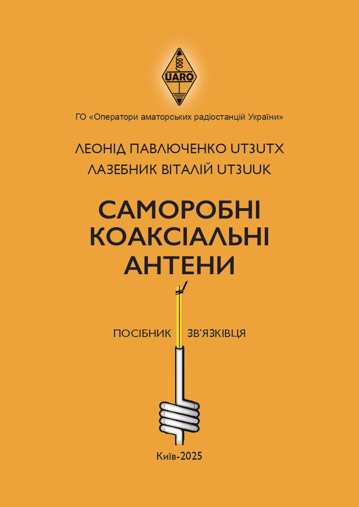
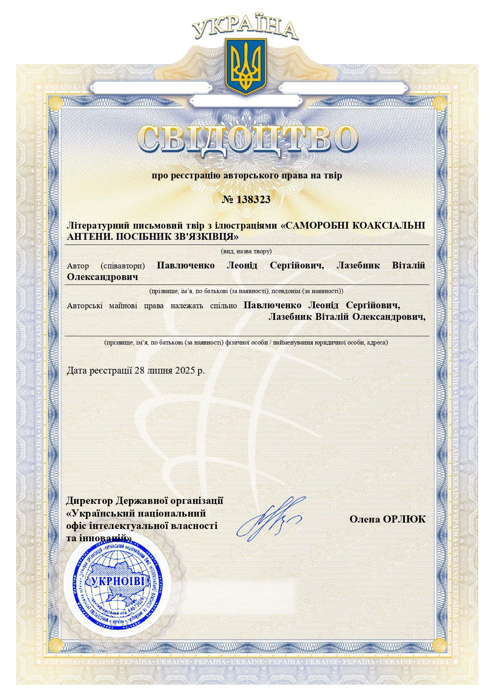
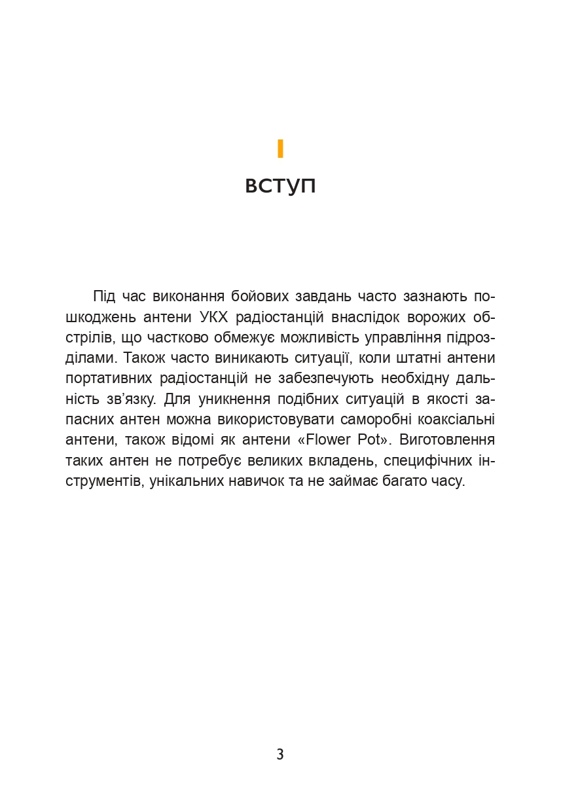
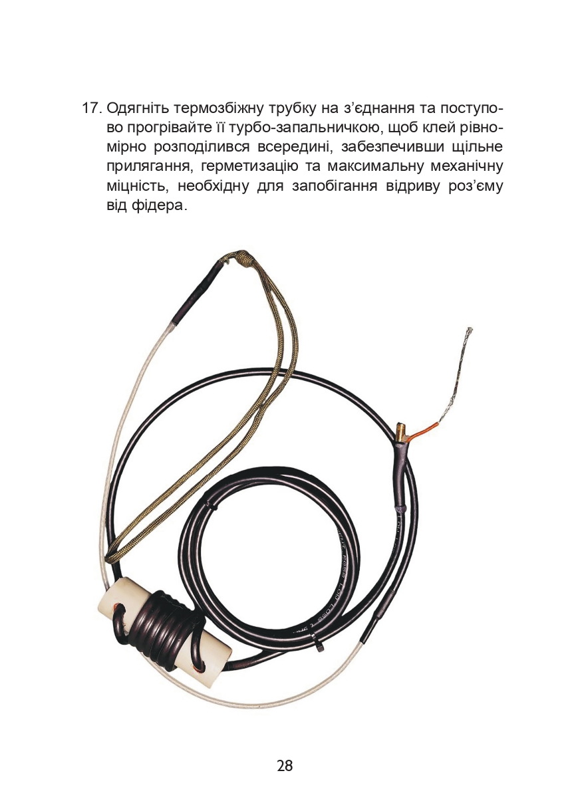
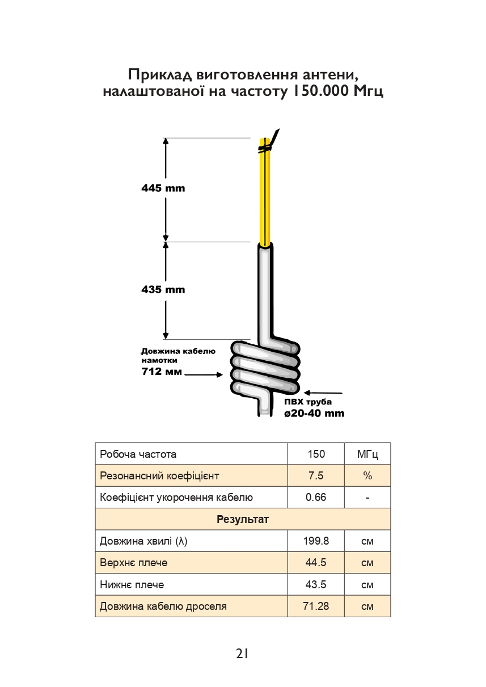

# Наші посібники

Посилання на калькулятор антени: 
[Flower pot](/docs/Calculators/flower_pot)

Від авторів

_Цей посібник ми зробили для своїх — для тих, хто вміє тримати зв’язок, навіть коли навколо глухо. 
Проста УКХ антена, яку можна зібрати з підручних матеріалів, — це не теорія, а робоче рішення, 
що не раз виручало в реальних бойових умовах._

_Ми зібрали все в одному посібнику - щоб він, коли справді треба, був під рукою._

З питань замовлення або співпраці звертайтесь на адресу: uaro.org.ua@gmail.com